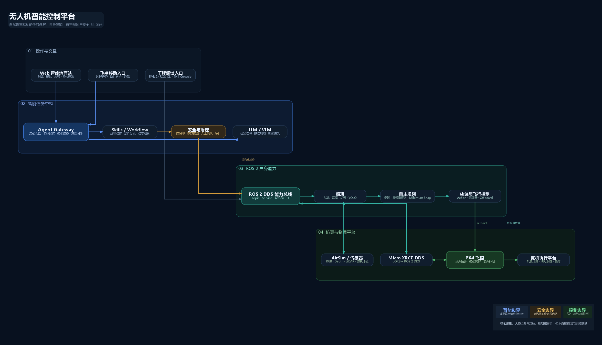

# 项目概览与当前状态

> 状态基线：2026-07-22。本文只描述代码仓库中真实存在的能力，不把规划中的功能写成已完成能力。

## 1. 项目在做什么

本项目构建一个自然语言驱动的无人机智能任务平台。用户在 Web 或远程消息入口描述目标，语言模型负责理解意图、查询状态、拆解任务和组合技能；ROS 2 负责传感器数据、模块通信、任务状态和控制接口；自主规划模块生成可执行轨迹；PX4 负责实时姿态控制和飞行安全。

核心分工是：

```text
LLM/VLM：理解、解释、规划、语义分析
Skills/Workflow：把模型计划约束成结构化任务
ROS 2：连接感知、规划、控制和界面
PX4：执行实时飞行控制
人工确认与安全监督：限制高风险动作
```

## 2. 当前总体架构



系统包含四层：

1. 交互层：Web 地面站、飞书、RViz 和 ROS CLI。
2. 智能任务层：Agent Gateway、LLM/VLM、Skills、Workflow 和确认中心。
3. ROS 2 能力层：Bridge、Perception、Autonomy、Control 和 Agent。
4. 仿真/飞控层：AirSim、Micro XRCE-DDS Agent、PX4 和未来真机传感器。

## 3. 已真实实现的能力

### 3.1 对话与任务编排

- WebSocket 流式多轮对话和历史记录。
- Claude Agent SDK Runtime 与 OpenAI-compatible Runtime 抽象。
- DeepSeek、Qwen 等 Provider 配置和模型切换。
- SQLite 保存会话、事件、确认和任务历史。
- Skills 目录、工具调用、Workflow 条件分支、重试、暂停、恢复和取消。
- 高风险动作的持久化确认请求和用户/会话绑定。
- 确认后调用真实 ROS 能力，而不是只生成文本说明。

### 3.2 感知与可视化

- AirSim 前视 RGB、深度图和 LiDAR 数据接入。
- Web RGB、深度摘要和 Three.js 三维点云显示。
- YOLO 目标检测及检测框叠加。
- 手动截图、任务目录归档、缩略图和任务报告。
- OpenAI-compatible VLM 单帧图像语义分析和低频自动分析入口。
- 感知摘要可供 Agent 查询并用于任务解释。
- `/perception/health` 统一输出 RGB、Depth、CameraInfo、点云、YOLO 和 VLM 的状态、数据年龄与频率。
- 检测业务 Topic 由 YOLO 唯一发布，已移除占位节点的空结果覆盖。

### 3.3 飞行与自主规划

- PX4 解锁、加锁、起飞、降落和原生 RTL。
- Offboard 位置/速度设定值和轨迹跟踪。
- ROS 2 `FollowWaypoints` Action，支持反馈、取消和结果。
- 世界坐标滚动体素地图、深度射线清障和障碍衰减。
- 动力学受限局部重规划、恢复绕行和安全悬停。
- 连续多航点 Minimum Snap 轨迹。
- 未来轨迹碰撞检查和局部重规划后剩余轨迹重新拼接。
- 里程计、深度超时以及定位质量异常时禁止继续盲飞。

### 3.4 Web 地面站

- 前端与 ROS 解耦，可独立部署在地面站电脑。
- ROS 网关通过 HTTP 提供查询/命令，通过 WebSocket 推送状态和日志。
- 显示飞行状态、RGB、深度、点云、任务态势、Skills 和对话历史。
- 支持确认、取消、任务进度、截图和报告下载。

## 4. 当前成熟度

| 子系统 | 当前评价 | 说明 |
|---|---|---|
| 软件架构 | 可用基础版 | 模块边界和接口已形成，可继续扩展 |
| 自然语言任务 | 可演示 | 能理解并组合已注册能力，但不是无限开放式执行 |
| Web 地面站 | 可演示 | 适合仿真联调和汇报，仍需权限与部署加固 |
| 感知 | 基础可用 | YOLO/VLM 可工作，缺少多帧跟踪和严格标定 |
| 自主规划 | 研究原型 | 已有闭环，但不是 EGO-Planner/Fast-Planner 等成熟系统的替代品 |
| 真机能力 | 未验收 | 缺少完整 VIO/SLAM、安全监督、硬件联调和飞行测试 |

## 5. 关键能力边界

- 当前 `/sensor/odometry` 主要来自 PX4/AirSim，不代表真实 VIO 已部署。
- 当前局部地图是项目内实现的 ESDF-style 体素距离查询，不是成熟 ESDF 后端。
- VLM 主要用于低频语义理解、任务解释和风险建议，不进入高频控制环。
- LLM 可以动态组合能力，但不能凭空执行仓库中不存在的底层动作。
- 单元测试通过不等于树林、动态障碍或真机环境已经验收。
- 电池、GPS、EKF、目标检测和障碍距离必须区分“数据真实异常”和“桥接字段缺失”。

## 6. 适合演示的闭环

推荐展示以下真实链路：

1. 查询飞行与感知状态。
2. 分析当前 RGB 画面并结合 YOLO/VLM 给出解释。
3. 下达“检查状态，安全则起飞”的组合任务。
4. 在确认中心批准高风险动作。
5. 展示 ROS Mission、PX4 模式、高度和轨迹状态实时变化。
6. 执行多航点任务，在指定位置截图。
7. 生成任务报告并执行降落或 RTL。

## 7. 推荐阅读

- 原理和数据链路：[系统架构与数据流](02-系统架构与数据流.md)
- 完整启动：[安装配置与启动](03-安装配置与启动.md)
- 实际操作：[使用与故障排查](04-使用与故障排查.md)
- 智能任务机制：[Agent、Skills 与 Workflow](05-Agent、Skills与Workflow.md)
- 尚未完成的工作：[限制与升级路线](07-限制与升级路线.md)
