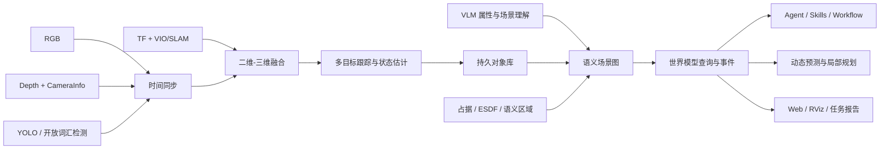

# 语义世界模型升级计划

> 文档日期：2026-07-21  
> 当前基线：RTAB-Map 影子定位 + 三维恒速卡尔曼跟踪
> 目标：将当前“YOLO + 深度 + TF 三维对象融合 MVP”升级为可持续观测、可查询、可预测、可支持任务决策的语义世界模型。

## 1. 项目目标

升级后的系统应能回答五类问题：

1. **我在哪里**：无人机的位姿、速度、坐标系和定位可信度。
2. **周围有什么**：对象的类别、三维位置、尺寸、置信度和证据来源。
3. **对象正在做什么**：稳定 ID、速度、运动方向、动静态和预测轨迹。
4. **场景中有什么关系**：人员是否位于航线、目标是否被遮挡、区域是否可通行。
5. **任务应如何响应**：悬停、主动观察、拍照、重规划、继续、降级或请求人工介入。

世界模型不代替飞控、ESDF 或轨迹控制器。它为 Agent 和确定性规划器提供带时间、置信度和证据的结构化环境状态。

## 2. 当前基线

### 2.1 已完成

- `semantic_fusion_node` 按检测时间戳融合 YOLO、Depth、CameraInfo 和 TF。
- `object_tracker_node` 使用恒速三维卡尔曼滤波输出持续对象。
- `/world_model/objects` 发布 `SemanticObjectArray`。
- 对象包含短时 ID、三维位置、速度、位置协方差、生命周期、时效和证据来源。
- 深度或 TF 缺失时降级为 `observed_2d`，不伪造三维位置。
- `/world_model/health` 提供同步、TF、内参和跟踪健康状态。
- RTAB-Map 影子模式提供 `map -> odom` 与 `/localization/odometry`，控制链仍使用 PX4 本地里程计。
- Agent `get_perception_summary` 可读取语义对象。
- Web 态势地图可显示具有有效三维位置的对象。

### 2.2 尚未完成

- 没有 ByteTrack/BoT-SORT/ReID，ID 仅依赖同类三维近邻。
- 尚未接入 ByteTrack/ReID，当前使用同类别三维距离门控。
- 已具备三维卡尔曼位置协方差，但尚未传播检测框、深度与定位的完整测量协方差。
- SLAM 模式可输出 `map` 坐标，但没有任务级对象持久化和重定位版本管理。
- 没有语义区域、对象关系和场景图。
- VLM 输出未与指定对象稳定绑定。
- 动态对象预测尚未进入局部规划和避障。
- 没有完整的世界模型查询 Service、事件 Topic 和历史数据库。

## 3. 目标架构



运行频率建议：

| 链路 | 目标频率 | 原则 |
|---|---:|---|
| TF / 里程计 | 20～100 Hz | 世界坐标基础，必须本地实时 |
| 几何深度融合 | 10～30 Hz | 确定性算法，不依赖云端 |
| YOLO / 跟踪 | 10～30 Hz | 结构化检测与跟踪 |
| 世界模型快照 | 2～10 Hz | 提供给 Agent 和 Web |
| VLM 语义增强 | 0.1～1 Hz | 事件触发、限频、可中断 |
| LLM 任务决策 | 按任务触发 | 不进入高频控制环 |

## 4. 数据和接口设计

### 4.1 保留的接口

| 接口 | 用途 |
|---|---|
| `/world_model/objects` | 当前对象快照 |
| `/perception/detections` | 原始二维检测证据 |
| `/sensor/camera/depth/front_center` | 几何深度证据 |
| `/tf` | 坐标系转换 |
| `/autonomy/status` | 规划与地图状态 |

### 4.2 计划新增的接口

| 名称 | 类型 | 主要字段 |
|---|---|---|
| `SemanticRelation.msg` | Message | subject_id、predicate、object_id/region_id、confidence、source |
| `SemanticRegion.msg` | Message | id、type、polygon、traversability、risk |
| `WorldModelSnapshot.msg` | Message | drone、objects、relations、regions、health |
| `WorldModelEvent.msg` | Message | event_type、object_ids、severity、evidence、timestamp |
| `QueryWorldModel.srv` | Service | query_type、filters、spatial_constraint、freshness_limit |
| `/world_model/events` | Topic | 人员进入航线、目标丢失、证据过期等事件 |
| `/world_model/predictions` | Topic | 动态目标未来时间段位置和协方差 |

### 4.3 证据约束

每个世界事实必须保存：

- `source`：來自何种 Topic、算法或模型。
- `stamp` 和 `age_sec`：不允许将历史事实当成当前事实。
- `confidence` 和可选协方差：表达不确定度。
- `evidence_type`：`observed`、`fused`、`inferred`、`predicted` 或 `unknown`。
- `frame_id`：三维结果必须明确坐标系。

LLM/VLM 推断不允许覆盖传感器事实；冲突时并列保留并降低推断置信度。

## 5. 工作包

### WP0：冻结基线和数据集

**目标**：让后续每次修改都可量化比较。

任务：

- 录制 RGB、Depth、CameraInfo、Detection、TF、Odometry 和世界模型输出 Rosbag。
- 准备空场、单人、多人交叉、车辆、短时遮挡、低照度和传感器断流场景。
- 保存 AirSim 真值或人工标注的类别、ID、三维位置和运动轨迹。
- 建立离线回放和指标导出命令。

交付：`world_model_baseline_v1` 数据集、场景清单和基线报告。

### WP1：时间同步、标定和 TF 健康度

**目标**：先确保三维结果的几何基础可信。

任务：

- 使用 `message_filters` 建立 RGB/Depth/Detection 近似时间同步。
- 检查 CameraInfo 分辨率、焦距、主点、深度尺度和编码。
- 对 `odom -> base_link -> camera_optical` 增加连通性、年龄和跳变监测。
- 为时间差过大、TF 缺失和内参错误定义明确降级状态。

验收：三维重投影误差和已知距离误差达到第 8 节阈值。

### WP2：多目标跟踪和三维状态估计

**目标**：从“每帧检测”升级为“持续对象”。

任务：

- 首选 ByteTrack 负责二维 ID 关联，保留 BoT-SORT/ReID 作为后续对照。
- 对每个 Track 使用恒速三维卡尔曼滤波，估计位置、速度和协方差。
- 定义 `tentative/confirmed/lost/removed` 生命周期。
- 对遮挡、重现、误检和类别短时抖动设置关联门限。
- 计算相对速度、碰撞时间 TTC 和是否侵入航线。

交付：`object_tracker_node`、跟踪回放测试和 ID/位置/速度指标。

### WP3：持久语义地图和场景图

**目标**：使目标离开视野后仍可被带时间地查询。

任务：

- 引入 VIO/SLAM `map` 坐标系，同时保留 `odom` 实时连续性。
- 建立对象存储：当前状态、历史观测、首次/最后观测、来源和任务引用。
- 定义语义区域：可通行区、道路、建筑、禁入区、巡检区和起降区。
- 建立关系：`inside`、`near`、`in_front_of`、`intersects_path`、`occludes`、`moving_towards`。
- 选择 SQLite 保存任务级对象历史，ROS Topic 仅传输当前快照。

边界：定位重置或 `map` 坐标跳变时，必须将旧对象标记为待重定位，不得直接继续用于飞行决策。

### WP4：VLM 语义增强

**目标**：让 VLM 补充“是什么场景、目标有什么属性”，不替代几何测距。

任务：

- 由事件触发 VLM：新目标、目标类别不确定、进入任务区域或用户主动查询。
- 将指定 Track 的图像裁剪、场景全图和结构化提示一起发给 VLM。
- 限定 VLM JSON Schema：属性、场景、风险、不确定信息和证据时间。
- 实现异步队列、限频、取消、缓存、超时和断路器。
- VLM 结果标记为 `inferred`，几何位置继续来自 Depth/LiDAR/TF。

验收：VLM 失败不影响跟踪、建图、规划和飞控更新。

### WP5：查询 API、Agent 工具和 Skills

**目标**：让 Agent 查询世界事实，而不是直接解析大量原始 ROS 消息。

计划工具：

- `query_objects(class, region, distance, fresh_within, dynamic)`
- `get_object_history(object_id, time_range)`
- `query_path_risks(path_id, horizon_sec)`
- `get_world_health()`
- `request_active_observation(target, viewpoints)`

计划 Skills：

- `InspectRegionSkill`：观察指定区域并形成对象清单。
- `TrackTargetSkill`：持续跟踪指定目标并报告丢失。
- `PersonOnPathSkill`：人员进入航线时悬停拍照，离开后恢复。
- `SemanticSearchSkill`：基于类别、属性和区域搜索。
- `SceneChangeReportSkill`：比较两次巡检的对象变化。

所有飞行动作仍经过 Capability 白名单、Workflow 校验、安全门控和人工确认。

### WP6：主动感知和任务事件闭环

**目标**：世界模型证据不足时，系统能安全地改变观察方式。

首个闭环任务：

```text
巡检前方区域
→ 查询世界模型
→ 发现人员进入规划航线
→ 悬停并拍照
→ 多帧确认人员状态
→ 人员离开航线
→ 重新进行轨迹安全检查
→ 恢复前进 20 米
→ 生成带证据的任务报告
```

触发条件、等待时间、重试次数和恢复条件必须结构化，不允许 LLM 无界等待或无限循环。

### WP7：动态预测与局部规划联动

**目标**：从“按当前距离反应”升级为“按未来碰撞风险规划”。

任务：

- 基于三维跟踪状态生成 2～5 秒时域的动态目标预测。
- 将对象尺寸、机体包络和协方差转换为随时间变化的禁入体积。
- 在候选轨迹上计算 TTC、最小时空间距离和碰撞概率代理值。
- 低置信度时限速或悬停，不允许将未知目标当成可通行空间。
- 局部重规划后重新拼接剩余 Minimum Snap 轨迹，保证位置、速度和加速度连续。

安全要求：世界模型是额外的动态障碍证据，不取消原有 Depth/LiDAR/ESDF 几何碰撞检查。

### WP8：可视化、审计和运行健康

任务：

- Web/RViz 分层显示原始检测、融合对象、预测轨迹、语义区域和任务航线。
- 颜色区分 `observed/fused/inferred/predicted/stale`。
- 对象详情显示 ID、类别、位置、速度、年龄、来源和历史。
- 任务报告固化世界快照、截图、事件、决策依据和物理结果。
- 监控各链路频率、延迟、丢帧、TF 失败、跟踪数量和 VLM 队列。

## 6. 分阶段路线

### 阶段 A：校赛可展示版（2026-07-21 至 2026-07-30）

范围严格控制在：

1. WP0 最小 Rosbag 与三个固定场景。
2. WP1 时间差、TF、CameraInfo 和深度尺度自检。
3. WP2 简化三维卡尔曼滤波与目标生命周期，不强行上 ReID。
4. WP5 增加世界对象查询工具。
5. WP6 实现“人员进入航线→悬停拍照→条件恢复”仿真闭环。
6. WP8 显示对象 ID、三维位置、时效和来源。

校赛前不替换 VIO/SLAM、ESDF 或默认控制器，不让新的语义链路直接接管安全关键控制。

### 阶段 B：稳定跟踪与持久对象（2～4 周）

- 完成 WP0～WP3。
- 接入 ByteTrack 并与当前三维近邻基线对比。
- 接入一种 VIO/SLAM 并建立 `map/odom` 双坐标策略。
- 完成对象历史库和基础场景关系。

### 阶段 C：认知任务闭环（4～6 周）

- 完成 WP4～WP6。
- 事件驱动 VLM、主动感知和三个世界模型 Skills。
- 实现世界模型事件到 Workflow 条件分支的可追溯链路。

### 阶段 D：动态避障与真机工程化（6～12 周）

- 完成 WP7～WP8。
- 动态目标预测与局部规划联动。
- 完成断网、检测器崩溃、深度超时、TF 失效和跟踪错乱注入测试。
- 从无桨台架、系留、低速小范围逐级进入真机。

## 7. 依赖关系

```text
WP0 基线数据
 ├─→ WP1 时间/标定/TF
 │    └─→ WP2 多目标跟踪
 │          └─→ WP3 持久地图与关系
 │                ├─→ WP4 VLM 增强
 │                └─→ WP5 Agent 查询与 Skills
 │                      └─→ WP6 主动感知闭环
 └─→ 几何地图/ESDF 基线
       └─→ WP7 动态预测与规划

WP8 可视化与运行健康贯穿所有阶段。
```

不能跳过 WP1 直接开发动态避障；错误的时间或 TF 会让所有动态预测失去意义。

## 8. 验收指标

### 8.1 感知与跟踪

| 指标 | 校赛阶段目标 | 工程化目标 |
|---|---:|---:|
| 已知距离中位绝对误差 | ≤ 0.5 m | ≤ 0.2 m 或 ≤ 3% |
| 时间对齐差 P95 | ≤ 150 ms | ≤ 50 ms |
| 有效 TF 查询成功率 | ≥ 95% | ≥ 99.5% |
| IDF1 | 记录基线 | ≥ 0.75 |
| ID Switch/分钟 | ≤ 5 | ≤ 2 |
| 三维位置 RMSE | 记录基线 | ≤ 0.5 m |
| 动态/静态判定准确率 | ≥ 80% | ≥ 90% |

### 8.2 系统和任务

| 指标 | 目标 |
|---|---:|
| 世界快照端到端延迟 P95 | ≤ 300 ms（不含 VLM） |
| 传感器失效检出时间 | ≤ 2 s |
| 历史数据被误当当前数据 | 0 次 |
| VLM 失败导致实时感知/飞控阻塞 | 0 次 |
| 人员侵入航线悬停召回率 | ≥ 95% |
| 人员未离开时错误恢复飞行 | 0 次 |
| 固定闭环任务成功率 | 校赛版 ≥ 90% |

### 8.3 性能预算

| 模块 | 校赛版预算 |
|---|---:|
| 语义融合 CPU | 单核平均 < 50% |
| 跟踪与状态估计 | 平均 < 10 ms/帧 |
| 世界模型内存 | < 500 MB（不含模型权重） |
| 发布对象上限 | 默认 100，超限按时效/任务相关度裁剪 |
| VLM 并发 | 1，队列可取消 |

## 9. 实验设计

### 实验 1：二维检测与三维融合对比

对比只用 YOLO 与 YOLO+Depth+TF，展示后者能输出世界位置、距离和航线关系。

### 实验 2：单帧近邻与多目标跟踪对比

统计遮挡和交叉场景中的 IDF1、ID Switch、速度误差和轨迹完整度。

### 实验 3：无世界模型与世界模型 Agent 对比

任务为“巡检前方，发现人员就悬停拍照，否则继续前进”。比较：

- 任务拆解正确率。
- 使用当前证据的比例。
- 历史数据误用次数。
- 任务恢复成功率。
- 人工介入次数。

### 实验 4：故障注入

分别断开 Depth、Detection、TF、VLM 和网络，验证系统不伪造结论、不阻塞实时链路并进入规定的降级状态。

### 实验 5：动态行人横穿

对比仅几何当前距离与动态预测方案的最小安全距离、提前减速时间、任务耗时和误停率。

## 10. 团队分工建议

| 角色 | 负责工作 | 主要交付 |
|---|---|---|
| 感知与跟踪 | WP1、WP2、WP4 | 同步融合、跟踪、VLM 队列 |
| 定位与地图 | WP1、WP3 | VIO/SLAM、TF、持久坐标和语义区域 |
| 规划与控制 | WP7 | 预测障碍、轨迹代价和重规划 |
| Agent 与 Workflow | WP5、WP6 | 查询工具、Skills、事件分支和报告 |
| Web 与数据 | WP0、WP8 | Rosbag、指标、态势图、审计与展示 |
| 系统集成与安全 | 全阶段 | 接口审查、回归、故障注入和版本冻结 |

每个模块都必须指定唯一 Topic 所有者、输入/输出 Schema、超时策略、测试数据和负责人。

## 11. 风险与应对

| 风险 | 影响 | 应对 |
|---|---|---|
| RGB/Depth 不同步 | 目标三维位置跳变 | 时间同步、最大时差门控、丢弃失配帧 |
| TF 跳变或定位重置 | 历史对象错位 | 坐标系版本、重定位状态、旧对象失效 |
| ID 切换 | 误判对象历史和速度 | ByteTrack/ReID、生命周期和协方差门控 |
| VLM 幻觉 | 错误语义属性 | 与传感器事实分层、Schema、置信度和人工复核 |
| 云端超时 | 任务等待 | 异步队列、取消、缓存、规则降级 |
| 对象数增长 | CPU/内存超限 | 滚动窗口、任务相关性裁剪、历史入库 |
| 语义规划误报 | 频繁悬停 | 多帧确认、TTC 门限、滞回和冷却时间 |
| 开发范围失控 | 校赛版不稳定 | 阶段 A 冻结范围，高风险项转入后续分支 |

## 12. 测试策略

每个工作包至少包含：

1. **纯函数单元测试**：投影、坐标转换、数据关联、滤波和关系判定。
2. **ROS 组件测试**：合成消息输入与 Topic/Service 输出。
3. **Rosbag 回放测试**：同一数据对比不同版本指标。
4. **故障注入测试**：超时、空帧、错误内参、TF 断链和 API 失败。
5. **任务端到端测试**：世界事实→Agent 计划→确认→ROS 执行→物理验证→报告。

回归阻断条件：历史事实被当作当前事实、无证据被当作无障碍、节点崩溃、任务无终态、未确认执行飞行动作。

## 13. 完成定义

语义世界模型只有同时满足以下条件才可称为“完成闭环”：

- 对象在多帧中具有可评测的稳定 ID 和三维状态。
- 每个事实都能追溯到来源、时间和置信度。
- Agent 只通过受约束查询和 Skills 使用世界模型。
- 动态对象可影响任务决策，但不能绕过底层几何安全检查。
- 传感器、VLM 或网络失效时有确定降级行为。
- 关键指标有固定数据集、自动脚本和版本对比报告。
- 仿真闭环连续执行 10 次至少 9 次成功，再进入分级真机测试。

## 14. 立即执行清单

1. 录制第一份包含 RGB/Depth/Detection/TF/Odometry 的 Rosbag。
2. ~~为 `semantic_fusion_node` 增加时间差、CameraInfo 和 TF 健康状态。~~ 已完成基础版。
3. ~~将当前近邻跟踪拆为独立 `object_tracker_node`，定义生命周期。~~ 已完成。
4. ~~增加恒速三维卡尔曼滤波和协方差字段。~~ 已完成基础版，待完整噪声传播。
5. 增加 `query_objects` 只读 Agent 工具。
6. 实现人员与当前规划航线的三维相交判定。
7. 用固定 AirSim 场景完成“人员侵入→悬停拍照→恢复任务”闭环。
8. 运行 10 次并导出任务成功率、位置误差、响应延迟和失败原因。

## 15. 当前迭代状态（2026-07-21）

| 工作包 | 状态 | 下一验收点 |
|---|---|---|
| WP0 基线数据 | 未开始 | 录制三个固定场景 Rosbag |
| WP1 同步/TF/内参 | 基础版完成 | 用 Rosbag 统计时间差 P95 和 TF 成功率 |
| WP2 跟踪/状态估计 | 基础版完成 | 多人交叉场景统计 ID Switch；再对比 ByteTrack |
| WP3 持久语义地图 | 进行中 | RTAB-Map 与 SQLite 对象历史已接入；下一步建立定位版本与场景关系 |
| WP4 VLM 增强 | 部分完成 | 将 VLM 结果绑定指定 Track，并加入异步限频队列 |
| WP5 查询/Skills | 部分完成 | `QueryWorldModel` 与只读 Agent 工具已完成；下一步增加对象历史和航线风险 Skills |
| WP6 事件闭环 | 未开始 | 人员侵入航线事件与可恢复 Workflow |
| WP7 动态规划 | 未开始 | Track 预测进入轨迹风险评估 |
| WP8 可视化/健康 | 进行中 | Web 已显示融合健康和稳定目标数，待对象详情与历史轨迹 |
