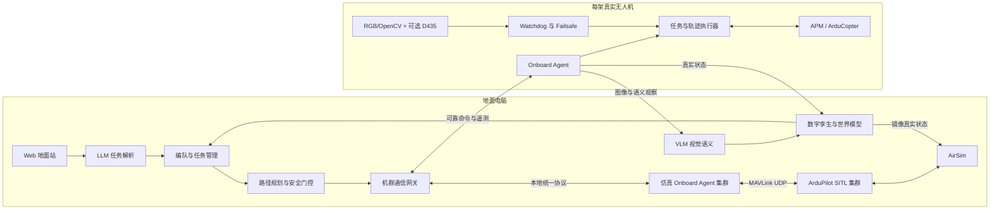

# AeroMind-APM Lite 开发计划

> 文档日期：2026-07-28
> 开发分支：`codex/aeromind-apm-lite`
> 文档状态：M0、M1、M1.5 已通过；下一阶段为 M2 V5+ 无桨台架
> 旧系统定位：现有 ROS 2 + PX4 + AirSim 工程保留为原型和能力参考，不在本阶段原地改造成 APM 真机系统。

## 1. 决策摘要

AeroMind-APM Lite 采用“地面重计算、机载轻执行”的非 ROS 架构：

- 地面电脑运行 Web 地面站、LLM/VLM、数字孪生、编队、路径规划、AirSim 和 ArduPilot SITL。
- 每架树莓派 4B 只运行轻量机载代理、`pymavlink`、OpenCV 和本机安全逻辑；D435 链路仅在实物确认并接入后启用。
- 仿真飞控使用 ArduCopter；真机目标同样是 ArduCopter，由 M2 读取实际固件后确认，负责姿态稳定、电机控制、EKF、GUIDED、LAND 和 RTL。
- 仿真与真机使用同一套机载代理和任务协议，仅切换飞控连接地址：SITL 使用 MAVLink UDP，真机使用串口。
- LLM 只生成受约束的结构化任务，VLM 只生成带证据的语义观察；二者不进入高频控制环，也不能绕过安全门控。

新系统不依赖 ROS 2 或 MAVROS。现有 AeroMind 中可复用的模型调用、提示词、Workflow、安全确认和 VLM 解析逻辑，将逐步抽取为普通 Python 服务；不直接复制 PX4/ROS 控制代码。

## 2. 项目目标与边界

### 2.1 总目标

建立一套可在四架 APM 真机和四架 ArduPilot SITL 之间复用的任务系统，完成：

1. **以实应虚**：仿真和真机执行同一版本任务，保存并比较编队形状、轨迹和任务结果。
2. **以虚控实**：虚拟环境完成规划和安全检查后，将版本化航点或短轨迹下发真机执行。
3. **以实控虚**：真机遥测和视觉语义结果更新数字孪生中的无人机、箱体和任务状态。
4. **虚实交互**：真实观察改变虚拟世界，虚拟世界据此重新规划并下发下一阶段真实任务。

### 2.2 必须交付的表演能力

| 项目 | 必须实现的闭环 |
|---|---|
| 编队飞行 | 四机一字、V 形、方形三种队形；仿真与真机使用同一编队任务；输出虚实轨迹对比 |
| 路径规划与避障 | 仿真建筑、街道、球门和隧道生成可执行路径；真实场地按统一坐标摆放纸箱和球门；若增配 D435 则提供本机近障碍安全兜底，未增配前仅演示已知静态地图路径 |
| 寻物定位 | 四机接收箱体搜索任务；RGB/OpenCV/VLM 输出编号、颜色、所在面和置信度；结果更新虚拟世界后触发重新分配和降落任务 |

### 2.3 本阶段不做

- 不让 LLM/VLM 直接输出电机、姿态或未经校验的速度指令。
- 不依赖地面 WiFi 维持 APM 的实时控制环。
- 不把普通 GPS 宣称为箱体表面附近的厘米级定位方案。
- 不在树莓派运行 AirSim、完整点云地图、全局规划或大模型推理。
- 不同时让旧 `swarmxian260413.py` 和新机载代理独占同一 APM 串口。
- 不在单机闭环未验收前并行开展四机实飞。

## 3. 架构原则

1. **任务与飞控解耦**：地面系统发送任务、航点或短轨迹；机载代理负责高频重发和执行监督。
2. **同一任务契约**：SITL 和真机消费完全相同的任务消息与状态机。
3. **真实状态优先**：真机模式下，数字孪生的观测状态以真机遥测为准；仿真预测使用独立的影子实体。
4. **本机安全闭环**：失联、目标过期和飞控异常必须在树莓派或 APM 本地收敛；若启用 D435，近障碍同样必须本机收敛。
5. **模型只做高层推理**：模型输出必须经过 Schema 校验、能力白名单、参数边界和人工确认。
6. **证据与时效优先**：遥测、图像、识别、规划和任务结果均携带时间戳、来源、置信度和有效期。
7. **先单机后集群**：所有四机能力建立在通过验收的单机链路之上。
8. **仿真不绕过飞控**：AirSim 只提供动力学和传感器；正式验收链路禁止使用 `moveToPosition` 等 AirSim API 直接控制虚拟机体。

## 4. 目标架构



## 5. 运行部署

### 5.1 仿真模式

地面电脑启动：

- AeroMind-APM Lite 地面服务。
- AirSim 场景。
- 每架虚拟无人机一个 ArduPilot SITL 实例。
- 每架虚拟无人机一个本地 `onboard_agent` 进程。

M1 已锁定单机 ArduCopter 提交、参数文件、AirSim 配置、`SYSID` 和 UDP 端口。四机 `SYSID_THISMAV` 与端口矩阵在 M5 冻结。任务执行只能经过 `onboard_agent -> MAVLink -> SITL -> AirSim` 闭环；AirSim RPC 仅用于传感器读取、场景管理和镜像实体显示。

数据链：

```text
ground_server
  -> 统一任务协议
  -> onboard_agent（本地进程）
  -> pymavlink UDP
  -> ArduPilot SITL
  <-> AirSim
```

### 5.2 真机模式

每架树莓派启动：

- `onboard_agent`
- `apm_link`
- `mission_executor`
- `d435_guard`（仅在实物盘点确认 D435 后启用）
- `color_detector`
- `failsafe`

数据链：

```text
ground_server
  -> WiFi
  -> onboard_agent（树莓派）
  -> pymavlink 串口
  -> APM
```

### 5.3 连接配置

同一套代码通过配置切换：

```yaml
vehicle_id: 1

# 仿真
fcu_url: udp:127.0.0.1:14550

# 真机示例
# fcu_url: /dev/ttyAMA0
# baudrate: 921600
```

真实串口、波特率、飞控 `SYSID_THISMAV` 和数传端口必须通过台架检查后确定，不能将示例值直接视为实机配置。

每台树莓派只运行一个由 `systemd` 管理的 AeroMind-APM Lite 机载服务。`apm_link` 是唯一 MAVLink 发送者并串行化所有命令；启动时必须验证 `vehicle_id == target_system == SYSID_THISMAV`，不匹配则保持只读并拒绝控制。

## 6. 虚实运行模式与状态权威

| 模式 | 命令目标 | 状态权威 | 用途 |
|---|---|---|---|
| `SIM` | SITL | SITL 遥测 | 算法开发和任务回归 |
| `REAL` | 真机 | 真机遥测 | 分级真机测试 |
| `SIM_THEN_REAL` | 先 SITL，验收后真机 | 当前执行对象 | 以虚控实 |
| `SHADOW` | 真机和预测 SITL 接收同一高层任务 | 真机是执行真值，SITL 是预测值 | 虚实误差评估 |
| `MIRROR` | 真机 | 真机遥测 | 以实控虚和地面态势显示 |

必须把以下状态分开保存：

- `planned_state`：规划轨迹中的期望状态。
- `predicted_state`：SITL 影子仿真的预测状态。
- `observed_state`：真机遥测状态。
- `semantic_state`：OpenCV/VLM 产生的环境事实。

禁止用预测状态覆盖真机观测，也禁止让镜像实体反向产生未经任务管理器确认的飞行命令。

## 7. 模块划分

建议新代码统一放入仓库根目录 `apm_lite/`，保持现有 `src/` 原型不动：

```text
apm_lite/
├── common/
│   ├── contracts/          # 命令、遥测、观察和 ACK Schema
│   ├── coordinates/        # map、ENU、NED、WGS84 转换
│   ├── sensors/            # RGB/Depth 统一数据契约
│   ├── formation/          # 编队几何与时序
│   └── mission/            # 状态机和校验规则
├── ground/
│   ├── api/                # HTTP/WebSocket API
│   ├── agent/              # LLM 任务解析与 Workflow
│   ├── vision/             # VLM 服务与证据管理
│   ├── twin/               # 数字孪生和世界模型
│   ├── planning/           # 路径规划与安全检查
│   ├── fleet/              # 四机连接、分配和编队
│   └── simulation/         # AirSim 与 SITL 生命周期
├── onboard/
│   ├── agent.py            # 机载进程入口
│   ├── apm_link.py         # pymavlink 唯一串口所有者
│   ├── executor.py         # 任务/短轨迹执行
│   ├── telemetry.py        # 遥测标准化
│   ├── sensor_source.py    # AirSim/RealSense/回放数据源接口
│   ├── d435_guard.py       # 本机深度安全区
│   ├── color_detector.py   # OpenCV 颜色候选
│   └── failsafe.py         # 失联、过期和异常收敛
├── web/
├── configs/
├── tests/
└── tools/
```

旧脚本中可参考的代码：APM 心跳、遥测解析、命令发送、航点判定和编队槽位计算。旧脚本的自定义协议、ACK 语义、单文件并发结构和避碰逻辑不直接原样复制。

复用边界：

- **可抽取**：现有模型 Provider、提示词和 Workflow 校验思想、确认幂等机制、纯轨迹/坐标/语义几何函数、SQLite 世界模型设计。
- **适配后复用**：Web 页面、能力目录和 VLM 调用；其输入输出必须改为非 ROS 严格 Schema。
- **不直接复用**：ROS 节点、TF、`px4_msgs`、`/fmu/*`、Micro XRCE-DDS 和 PX4 Offboard 控制代码。
- **旧 APM 项目仅作参考**：不复用单文件并发、旧二进制协议、“收到即完成”的 ACK 和只按 GPS 距离判断的避碰。

仿真 `AirSimSensorSource` 和离线 `ReplaySensorSource` 先实现统一 RGB/Depth 契约；实物确认 D435 后接入 `RealSenseSensorSource`，使同一深度安全算法可以通过录包完成虚实回归。

## 8. 通信契约

### 8.1 初版传输选择

- 命令、ACK、状态：WebSocket 上的版本化 JSON，便于联调和浏览器接入。
- 图片：按任务触发的 HTTP/JPEG 上传，不持续上传原始深度流。
- APM：MAVLink 2，经 UDP 或串口传输。
- 后续只有在测量证明 JSON 成为瓶颈时，才迁移到 MessagePack 或 Protobuf。

WebSocket 断线重连后必须重新完成身份确认和状态同步。发送队列采用有界长度，过期遥测直接丢弃，禁止积压后回放为当前状态。

每架无人机使用独立凭据。握手至少校验 `vehicle_id`、`session_id`、随机挑战和协议版本；高风险命令校验递增序号和重放窗口，旧会话或重复序号不得重新触发动作。外场链路是否使用 TLS 或 HMAC 在 M0 根据网络拓扑冻结。

### 8.2 核心消息

所有消息至少包含：

```text
schema_version
message_id
mission_id
vehicle_id
sequence
session_id
created_at_utc
ttl_ms
frame
frame_calibration_id
```

发送方单调时钟值不跨设备传输或比较。接收方在消息到达时记录本机单调时钟，并从该时刻开始执行 TTL 和看门狗判断；UTC 只用于审计、排序辅助和时钟偏差门控。

核心类型：

| 消息 | 关键内容 |
|---|---|
| `VehicleCommand` | arm、takeoff、land、rtl、hold、cancel |
| `TrajectorySegment` | 带时间的短轨迹、速度/高度边界、坐标系 |
| `FormationCommand` | 队形、虚拟领航点、间距、转换持续时间 |
| `VehicleTelemetry` | 位姿、速度、模式、解锁、电池、GPS、健康度 |
| `SemanticObservation` | 箱体编号、颜色、所在面、三维位置、置信度、证据 |
| `MissionAck` | accepted、running、completed、failed、cancelled、expired |
| `Heartbeat` | 软件版本、配置摘要、最后命令、链路健康度 |

### 8.3 任务状态机

```text
created
  -> validated
  -> accepted
  -> running
  -> completed | failed | cancelled | expired
```

规则：

- `accepted` 只表示机载端接收并通过本地校验，不表示物理动作完成。
- `completed` 必须由飞控状态、位置误差和任务条件共同确认。
- MAVLink `COMMAND_ACK` 只证明飞控接受或拒绝某条命令，不能替代起飞高度、接地状态、模式和解锁状态的物理完成判定。
- 状态只能单调前进，重复消息通过 `message_id` 和 `sequence` 幂等处理。
- 命令超过 `ttl_ms` 后不得执行。
- 新任务不能静默覆盖正在执行的高风险任务。

## 9. 坐标系、标定与时间

### 9.1 统一坐标

地面任务使用右手 `map` 坐标。每个场地必须用两个固定测量点定义，不能由操作人员临时选择方向：

```text
O：场地固定原点标志
X：从 O 指向固定参考标志 X1
Y：水平面内位于 X 左侧
Z：向上
```

每个后端负责转换：

- 场地 `map` 与地理 ENU 之间的固定刚体变换。
- AirSim NED 与 `map` 之间的转换。
- ArduPilot 本地 NED 与 `map` 之间的转换。
- WGS84 经纬高与本地切平面之间的转换。
- 相机 optical frame、机体 FRD 与 `map` 之间的转换。

每次标定生成不可变的 `frame_calibration_id` 和配置摘要哈希。任务同时绑定场地标定、每架飞机的 home 原点和海拔基准；标定不匹配时禁止执行。

### 9.2 场地标定

每次部署必须记录：

- 场地原点经纬高或测量点。
- `map` X 轴参考标志和相对真北的航向。
- 四个起飞点、箱体、球门、隧道和纸箱轮廓坐标。
- 相机内参、深度尺度和相机到机体外参。
- 每架 APM 的 home 原点、相对高度基准和飞行前标定版本。

普通 GPS 不能保证在箱体指定面附近精确降落。首版使用大尺寸 AprilTag/ArUco 或明确的视觉降落标志完成末端相对定位；后续再评估 RTK、UWB 或 VIO。

### 9.3 时间要求

- 地面电脑与四台树莓派使用 NTP/Chrony 同步。
- 网络消息携带 UTC 创建时间和 TTL；接收后只使用接收方本机单调时钟计算存活时间，不跨机器比较单调时钟。
- 时钟偏差超过门槛时禁止进入多机同步任务，但紧急 HOLD/LAND/RTL 不依赖网络时钟。
- 遥测、图像和 VLM 结果均定义最大允许年龄。

## 10. AI、VLM 与确定性感知

### 10.1 LLM 链路

```text
自然语言
  -> LLM 输出 MissionPlan JSON
  -> Schema 校验
  -> 能力白名单和参数边界
  -> 人工确认
  -> 仿真验证
  -> 真机任务
```

LLM 允许决定任务意图、对象、顺序和约束，不允许直接生成 MAVLink 数据包或绕过飞行状态检查。

### 10.2 VLM 链路

```text
真机到达观察点并悬停
  -> 上传 3 张带时间和位姿的 JPEG
  -> OpenCV 颜色候选
  -> VLM 识别箱体编号、颜色、所在面和关系
  -> 多帧一致性与 Schema 校验
  -> SemanticObservation
  -> 更新数字孪生
```

VLM 结果标记为模型推断，必须保留原图、提示词、模型、响应和时间。VLM 超时或失败不能阻塞飞控遥测、已启用的本机深度安全检查或任务取消。

### 10.3 可选 D435 本机链路

所给硬件文档没有列出 D435、其他深度相机或激光雷达。本节是增配 D435 后的实现约束，不代表当前四架飞机已经具有深度感知能力。

- 使用 `librealsense`/`pyrealsense2` 直接采集，不依赖 ROS 驱动。
- 首版深度配置从低负载开始，例如 `424x240 @ 15 FPS`，最终参数以实测为准。
- 深度图划分前、左、右、上、下安全区域，使用有效深度分位数而非单个最小噪点。
- RGB 按任务触发压缩上传；不通过 WiFi 持续发送原始深度图。
- OpenCV 提供颜色、轮廓和深度几何证据；VLM 提供开放语义解释。

## 11. 三个表演项目的实现方案

### 11.1 项目一：编队飞行

采用“虚拟领航点 + 槽位轨迹”方案：

1. 地面编队控制器生成虚拟领航点轨迹。
2. 纯函数编队库计算每架无人机在一字、V 形、方形中的槽位。
3. 队形切换使用带持续时间的平滑插值，禁止位置瞬间跳变。
4. 队形切换前求解无人机到新槽位的分配，避免交叉换位，并对所有机体的整段时空轨迹做碰撞检查。
5. 所有无人机先报告 `ready`，再按统一 UTC 起始窗执行；未就绪、掉队或失联时按预定义策略保持、取消或整体降级。
6. 地面发送 2～5 秒短轨迹段，机载端以 10～20 Hz 向 APM 重发目标。
7. 轨迹过期时机载端进入 HOLD，不继续外推未知目标。
8. 同一任务分别运行于 SITL 和真机，计算槽位误差、队形切换时间和最小机间距。

首版不依赖 ArduPilot 原生 FOLLOW，以避免领机 SYSID、偏移参数和链路新鲜度造成额外不确定性。

### 11.2 项目二：路径规划与避障

1. 使用统一 `map` 坐标建立虚拟道路、建筑轮廓、球门和隧道。
2. 全局规划器输出带机体包络和安全距离的路径。
3. 仿真验证路径可达、净空、速度和高度边界。
4. 将通过验证的路径转换为版本化短轨迹发送真机。
5. 若实物接入 D435，首版安全层只实现“限速、HOLD、取消当前段”，定义为防碰撞安全停止，不宣称已经具备自主绕障；没有深度传感器时，本阶段不得演示未知障碍实时避障。
6. 第二阶段才上传带位姿、时间和置信度的障碍几何，由地面规划器生成新轨迹；新轨迹再次通过机载安全层。
7. 真机偏离规划路径或出现未建模障碍后，上报事件，由地面重新规划。

纸箱高度低于虚拟高楼时，规划仍按相同投影轮廓的不可穿越柱体处理，防止真机从纸箱上方抄近路导致虚实结果失去可比性。

### 11.3 项目三：寻物定位

1. 地面为每架无人机分配箱体和观察航点。
2. 到达后 HOLD，采集多帧 RGB、位姿，以及可用时的对应深度。
3. OpenCV 和 VLM 生成编号、颜色、所在面、置信度和证据；只有经过标定的深度来源才能输出距离。
4. 数字孪生更新箱体语义属性，任务管理器完成颜色目标重新分配。
5. 规划器生成目标面附近的安全观察点和视觉引导降落段。
6. 末端定位依赖视觉标志/相对定位，不依赖普通 GPS 直接降到箱体附近。

实际 RGB/深度相机的型号、安装方向和观察机动必须在 M4/M6 前冻结。单个固定前视相机无法天然观察箱体前、后、左、右和顶面；顶面任务需要经验证的俯视机动、可调安装，或增加独立下视 RGB 相机。隧道若造成 GPS 拒止，必须增加 AprilTag/UWB/VIO 等定位来源；没有定位来源时只能把隧道限制为保持 GPS 可用的演示结构，不能宣称完成 GPS 拒止自主穿越。

## 12. 机载安全设计

机载代理至少实现以下独立保护：

- 地面心跳和轨迹段超时。
- 飞控心跳、模式、解锁状态和 EKF/GPS 健康检查。
- 飞控硬件型号、ArduCopter 固件和参数文件兼容检查；默认不得关闭 `ARMING_CHECK` 来掩盖预检失败。
- 最大水平速度、垂直速度、高度、航程和地理围栏。
- 已启用深度传感器的数据过期、无效深度和近障碍停止。
- 低电量和通信失联策略。
- 任务取消、HOLD、LAND、RTL 的明确优先级。
- 遥控器人工接管和物理急停流程。

建议控制优先级：

```text
人工接管/紧急停机
  > APM failsafe/RTL/LAND
  > 本机安全 HOLD
  > 任务取消
  > 正常轨迹执行
  > 新任务请求
```

实飞必须按无桨台架、带桨固定测试、系留、单机低空、单机任务、双机、四机逐级放行。任何一级未通过不得跳级。

故障动作在 M0 固化为配置表，至少覆盖：

| 故障 | 默认动作 | 恢复条件 |
|---|---|---|
| 地面链路超时 | HOLD，超出二级时限后按场地策略 LAND 或 RTL | 重新认证且人工确认恢复 |
| 轨迹段过期 | HOLD | 新轨迹通过版本和连续性检查 |
| D435 过期/无效 | 限速或 HOLD，不进入未知区域 | 连续有效帧达到门槛 |
| 近障碍 | 取消当前段并 HOLD | 地面新路径验证通过 |
| EKF/GPS 异常 | 交由 APM failsafe，禁止继续 GUIDED 任务 | 飞控健康恢复且人工确认 |
| 低电量 | 拒绝新任务并 LAND/RTL | 不允许任务中自动恢复 |
| 单机掉队 | 掉队机 HOLD；其余飞机按任务配置 HOLD 或解散编队 | 全机状态重新评审 |

表中的 HOLD 是逻辑安全结果，不预设某一个 ArduPilot 模式。M0/M2 根据飞控版本、定位状态和场地条件，将其明确映射为 GUIDED 定点、LOITER 或 BRAKE，并验证不可用时的后备 LAND/RTL 行为。

## 13. 开发阶段与验收门槛

### M0：架构、协议与仓库骨架

状态：**已通过**。协议、状态机、配置、Schema、依赖边界和 CI 门禁已提交。

交付：

- 新目录骨架、依赖边界和配置规范。
- JSON Schema、任务状态机、坐标约定和错误码。
- 仿真/真机配置样例。
- ArduCopter/AirSim 版本、参数、`SYSID`、UDP 端口和飞控兼容矩阵。
- 单元测试与持续集成入口。

CI 必须检查 `apm_lite/` 不导入 `rclpy`、`px4_msgs` 或 MAVROS，并检查所有仿真飞行命令都经统一机载代理。

验收：同一消息可序列化、校验、重放；错误版本、过期命令和重复命令被明确拒绝。

### M1：单机 ArduPilot SITL 闭环

状态：**已通过（2026-07-28）**。AirSim 1.8.1 / ArduCopter 4.7.0 固定任务完成 `10/10`，独立 RTL 通过；完整证据与哈希见 `apm_lite/docs/M1_PROGRESS.md`。

交付：

- `pymavlink` 连接、遥测、解锁、起飞、GUIDED 航点、HOLD、LAND、RTL。
- `onboard_agent` 与 `ground_server` 的心跳、命令、ACK 和状态上报。
- AirSim/ArduPilot SITL 启停脚本。

验收：固定任务连续运行 10 次，至少 9 次完整结束；无无限等待；每次都有唯一终态和日志；测试中不存在绕过 SITL 的 AirSim 直接飞行 API。

### M1.5：手动仿真与 Lite Web 地面站

状态：**已通过（2026-07-28）**。自动 M1 生命周期和固定任务链保留不变；操作者已在非 Blocks 的 AirSim 场景中完成 UE/SITL/Web 正式现场联调，机器证据见 `apm_lite/docs/M1_5_ACCEPTANCE.md`。

交付：

- 与 Blocks 无关的 AirSim `settings.json` 模板和按当前 WSL 地址生成工具。
- 普通前视单目 RGB 相机基线，以及隔离超时、缓存和自动重连的 AirSim Scene 图像桥；不声明 D435、深度图或激光雷达。
- 只连接现有 `udpin:0.0.0.0:14550` 的 FastAPI/WebSocket 网关，不启动或关闭 UE/SITL。
- 非 ROS Web 地面站、LOCAL_NED 遥测、轨迹显示、安全控制按钮和三层命令证据。
- Web 页面显示真实 AirSim `front_center` PNG 画面；VLM 面板保持明确未接入，不生成伪造语义结果。

验收：Lite 全量 `155 passed`，Schema、compileall、flake8、JavaScript 语法和静态资源契约通过。正式 `8000` SITL 链路完成 GUIDED、3 米起飞、LAND、再次起飞和 RTL；DataFlash 命令结果均为 0，最终遥测为已落地且加锁。相机接口返回真实 PNG 帧且持续递增，飞行命令仍只经过 OnboardAgent、MAVLink、SITL 和 AirSim 物理闭环。

### M2：真实 APM 台架与单机低空

状态：**待开始**。第一步只做 CUAV V5+ 拆桨、独立供电、只读串口探测，不直接进入低空飞行。

交付：

- 串口配置、参数清单、启动守护和日志轮转。
- 无桨台架命令验证。
- 失联、进程退出、过期轨迹和人工接管测试。
- 30 分钟树莓派资源与时序压力测试。

验收：故障注入时均在规定时间进入预期状态；30 分钟内无 OOM、进程重启、持续热降频或控制看门狗遗漏；通过安全评审后才进行低空测试。

### M3：虚实双向闭环

交付：

- `SIM_THEN_REAL`、`MIRROR` 和 `SHADOW` 模式。
- 统一坐标标定工具。
- planned/predicted/observed 轨迹记录和误差报告。
- 任务、软件提交、ArduCopter、参数、场景和标定配置的版本哈希。

验收：同一单机任务先仿真后真机执行；真机轨迹可在虚拟场景实时显示；状态源不混淆。

### M4：LLM/VLM 服务化

交付：

- 从现有 AeroMind 提取 LLM 调用、结构化 MissionPlan 和 Workflow。
- VLM 图片分析服务、Schema、超时、缓存和证据存档。
- OpenCV 颜色检测交叉验证。

验收：模型不可用时飞控和安全链保持工作；模型非法输出不能形成可执行任务。

### M5：四机编队

交付：

- 四个 SITL/agent 实例和四机配置生成器。
- 三种队形、平滑切换、最小机间距和过期 HOLD。
- 新槽位分配、整段时空碰撞检查、同步起始和未就绪/掉队策略。
- 单机失联时的其余机体处置策略。

验收：三种队形分别完成 10 次仿真回归，再按双机到四机顺序进行真机验收。

### M6：路径规划与可选 D435 安全层

交付：

- 场地建模、全局路径、轨迹安全检查和版本管理。
- D435 深度区域、安全阈值、数据新鲜度和否决事件。
- 仿真路径到真机轨迹转换。
- 可选的障碍几何上报和地面重规划；未实现时明确标记为“安全停止”能力。

验收：固定道路、建筑、球门和隧道场景完成重复测试；传感器断流和突发障碍不会被当成安全空间。

### M7：寻物、语义更新与降落

交付：

- 箱体观察、图片上传、多帧 OpenCV/VLM 识别。
- 语义世界模型更新和颜色目标重分配。
- 目标面附近观察点与视觉引导降落。
- 相机安装/观察机动验证，以及顶面和 GPS 拒止场景的附加传感器决策。

验收：使用未提前固定颜色排列的测试集，统计箱体编号、颜色、所在面、任务分配和降落成功率；高置信错误必须为 0，否则进入拒绝或人工复核。

### M8：演示固化

交付：

- 一键启动、预检、演示脚本和故障恢复手册。
- 任务日志、图像证据、虚实轨迹和指标报告。
- 固定场地布置图、检查清单和人工接管流程。

验收：三个项目按正式演示顺序连续完成，失败时能明确降级，不以人工修改数据库或伪造状态完成演示。

## 14. 测试与指标

### 14.1 软件测试

- 协议 Schema、版本和幂等测试。
- 坐标转换往返误差测试。
- 任务状态机和超时测试。
- 录制遥测离线重放测试。
- 假飞控和 SITL 集成测试。
- 网络丢包、延迟、断连和重连测试。
- D435 空帧、无效深度、遮挡和断开测试。
- LLM/VLM 超时、非法 JSON、低置信度和多帧冲突测试。
- 身份冒用、旧会话、重复序号和命令重放测试。
- 固件/参数/场地标定哈希不匹配测试。

### 14.2 核心指标

| 类别 | 指标 |
|---|---|
| 通信 | 往返延迟、断线检测时间、重连时间、过期消息拒绝率 |
| 控制 | 航点误差、轨迹 RMSE、最大速度/高度、任务完成率 |
| 编队 | 槽位 RMSE、切换时间、最小机间距离 |
| 虚实 | planned/predicted/observed 轨迹误差、任务结果一致率 |
| 感知 | 颜色、编号、所在面准确率；VLM 延迟；低置信度拒绝率 |
| 安全 | 近障碍最小距离、失联收敛时间、人工接管成功率 |
| 资源 | 树莓派 CPU、内存、温度、D435 帧率和代理循环抖动 |

M2 前冻结资源门槛；至少要求 30 分钟压力测试无热降频、OOM 或进程重启，向 APM 发送设定值的异常空档不得超过 500 ms。

阈值在 M0/M1 基线测试后冻结，不在正式演示前临时放宽以掩盖失败。

## 15. 主要风险与控制措施

| 风险 | 控制措施 |
|---|---|
| WiFi 抖动导致目标中断 | 下发短轨迹段；机载缓存并高频重发；过期 HOLD |
| 普通 GPS 精度不足 | 已知场地标定；末端视觉标志；评估 RTK/UWB/VIO |
| 四机时间和坐标不一致 | Chrony、统一 map、起飞点测量、日志携带时间和 frame |
| D435 视场有限或深度失效 | 未知视为不安全；限速/HOLD；不宣称全向避障 |
| 前视 D435 无法覆盖箱体五个面 | 冻结安装与观察机动；必要时增加下视 RGB 相机或云台 |
| 隧道导致 GPS 拒止 | AprilTag/UWB/VIO；未接入前限制场景并明确能力边界 |
| VLM 幻觉或延迟 | 多帧、OpenCV 交叉验证、Schema、置信度和人工确认 |
| 树莓派资源不足 | 不运行 ROS/模型；降低深度分辨率；资源门禁和守护进程 |
| 旧脚本与新代理抢串口 | `apm_link` 是唯一串口所有者；需要分流时使用独立 MAVLink 路由 |
| 仿真通过但真机模型不一致 | 分级速度/高度、真实安全层、Shadow 对比和逐级验收 |

## 16. 首个垂直切片

第一阶段只实现以下完整链路：

```text
用户输入“1 号机起飞到 2 米，前进 3 米后降落”
  -> LLM 输出 MissionPlan JSON
  -> Schema 和安全参数校验
  -> 单机 ArduPilot SITL 执行并完成
  -> 人工确认
  -> 同一任务发送真实树莓派代理
  -> APM 执行
  -> 真机遥测更新 AirSim 镜像实体
  -> 输出 planned/predicted/observed 轨迹报告
```

在该垂直切片通过之前，不开始四机编队、复杂路径规划或箱体降落。它将验证新架构最核心的任务协议、同构执行、虚实同步、AI边界和安全收敛是否成立。

## 17. 近期任务清单

1. [x] 冻结非 ROS 架构、运行模式和首个垂直切片。
2. [x] 建立 `apm_lite/` 骨架、v1 协议、认证、状态机、配置和 CI 门禁。
3. [x] 完成假飞控、单机 ArduPilot/AirSim SITL 与 `10/10 + RTL` M1 验收。
4. [x] 根据硬件资料确认 CUAV V5+、Raspberry Pi 4B 4GB、F9P 和 TELEM2 接线风险。
5. [x] 增加独立手动 AirSim/SITL 配置、Lite 浏览器网关和非 ROS Web 地面站，保留自动 M1 验收链。
6. [x] 由操作者启动其他 AirSim 场景和 SITL，完成 M1.5 现场手动链路检查、真实 MAVLink 飞行闭环和 AirSim RGB 画面验证。
7. [ ] 在拆桨台架读取真机固件/板型/完整参数，确认 TELEM2 串口映射、电平、波特率和独立供电。
8. [ ] 盘点四架飞机的 RGB/深度相机实物；没有 D435 时冻结“仅已知地图规划、不做未知障碍实时避障”的演示边界。
9. [ ] 解决“四个/五个箱体”数量冲突，并定义颜色标识面附近的安全降落点、朝向和允许误差。
10. [ ] 为旧 `swarmxian260413.py` 建立“可复用逻辑/必须重写逻辑”迁移清单。
11. [ ] 盘点现有 AeroMind 的 LLM、VLM、Workflow 和 Web 代码，为 M4 服务化复用做准备。

## 18. 后续里程碑必须确认的外部条件

以下问题会改变 M2-M7 的实现方案，进入对应功能开发前必须形成书面结论：

1. 实际是四个还是五个箱体，每架无人机与箱体是否一一对应。
2. 飞控已确认为雷迅 V5+（现代 Pixhawk 兼容类，5 个 UART）；仍需读取实际 ArduCopter 版本、固件板型、完整参数，并用台架确认 TELEM2 电平、串口参数和供电边界。
3. 四台树莓派的内存版本、操作系统、供电、散热，以及实际相机的接口和 USB/CSI 带宽。
4. 是否采购 D435；实际相机安装角度；是否允许增加下视相机、云台、AprilTag、RTK、UWB 或 VIO。
5. 真实隧道是否会遮挡 GPS，演示场地是否允许使用外部定位标志。
6. “最近位置降落”是地面降落点、箱体旁安全垫，还是要求接触箱体表面；后者不属于普通多旋翼安全任务。
7. 地面 WiFi、数传和遥控链的覆盖范围、延迟、带宽和失联策略。
8. 老师对“避障”的验收是遇障停止、重新规划绕行，还是未知动态障碍实时自主绕行。
