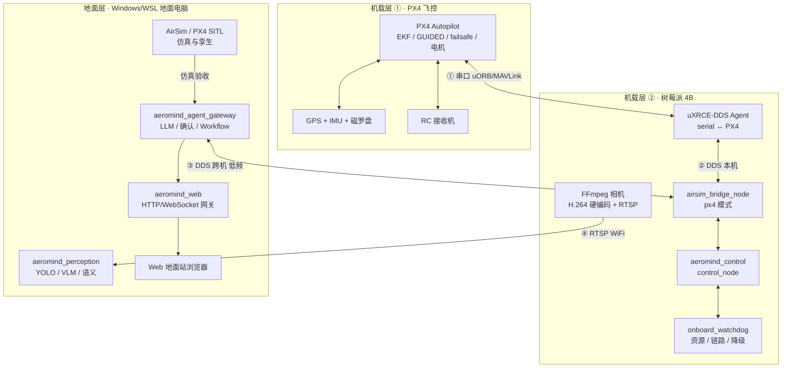

# AeroMind PX4 真机迁移与外场实验方案
### （ROS 分层版 · 树莓派 4B 机载 · 详细实施稿）

| 项 | 内容 |
|---|---|
| 文档版本 | v3（详细实施稿，替代 v2） |
| 文档日期 | 2026-08-28 |
| 建议分支 | `codex/aeromind-px4-real` |
| 适用对象 | 飞控/机载开发、外场实验、安全负责人 |
| 关联文档 | [14-AeroMind-APM Lite 开发计划](14-AeroMind-APM-Lite开发计划.md) · [07-限制与升级路线](07-限制与升级路线.md) |

---

## 阅读指南

| 你想了解 | 直接看 |
|---|---|
| 一句话结论、三条硬约束 | 第 1 章 |
| 整体架构、机载/地面分哪些组件 | 第 2 章 |
| Pi 4B 会不会过载、怎么保证不过载 | 第 3 章 |
| 真机接线、串口、供电、相机 | 第 4 章 |
| 现有代码要改哪些、怎么部署 | 第 5 章 |
| Pi 和地面电脑怎么用 ROS 跨机通信 | 第 6 章 |
| 外场实验怎么分级、怎么做 | 第 7 章 |
| 安全机制、异常时飞机会怎么收敛 | 第 8 章 |
| 时间计划、每阶段验收标准 | 第 9 章 |
| 交付哪些文件、一键安装脚本 | 第 10 章 |
| 风险、待确认问题、常见排障 | 第 11~13 章 |
| Pi 装机命令、常用调试命令 | 第 14 章附录 |

**阅读约定**：文中「提示」为建议，「注意」为易错点，「警告」为安全相关、必须遵守。

---

## 术语表

| 术语 | 含义 |
|---|---|
| FCU / 飞控 | 飞行控制单元，即 PX4 Autopilot 板载固件，负责姿态/位置控制与电机 |
| Pi 4B | 树莓派 4B，本方案的机载电脑（Onboard Computer），不替代飞控 |
| GUIDED | PX4 一种外部引导模式：地面给它目标点，PX4 自己完成导航与控制 |
| OFFBOARD | PX4 外部控制模式：需要持续心跳，地面直接给位置/速度设定值 |
| MAVLink | 飞控与外部设备之间的通信协议（v2） |
| uXRCE-DDS | PX4 与 ROS 2 的桥接通道（uORB ↔ DDS），本方案用串口连接真机 |
| SITL | Software In The Loop，PX4 仿真（Gazebo），真机替身 |
| ROS_DOMAIN_ID | ROS 2 逻辑网络隔离号，跨机通信必须一致 |
| DroneState | 本工程自定义的无人机综合状态消息 |
| 看门狗 | 监控资源/链路并在异常时降级或触发安全动作的守护节点 |
| L0~L3 | 实验分级：台架 / 系留 / 低空小范围 / 外场任务 |

---

## 1. 目标与范围

### 1.1 背景：为什么要做真机迁移

现有 AeroMind 系统是 **ROS 2 Humble + PX4 + AirSim + uXRCE-DDS** 的研究原型，已具备
感知、自主规划、Agent 任务编排、Web 地面站等完整能力，但都在**仿真**中运行。要进入
PX4 真机外场实验，必须解决三个现实问题：

1. **部署重**：原方案把整条 ROS 链（AirSim 桥、感知、VLM、Web）都放在一台机器上，
   直接搬上机载电脑会过载，也不适合外场。
2. **定位差异**：仿真用 AirSim 里程计，真机要靠 GPS/EKF/RC/failsafe 建立可信基线。
3. **安全**：真机飞行的风险远高于仿真，必须有分级门禁、失联收敛和人工兜底。

### 1.2 目标与量化指标

| # | 目标 | 量化验收口径 |
|---|---|---|
| G1 | 现有 ROS 2 代码最小改动迁移到真机 | 除新增看门狗/相机/launch 外，现有节点代码改动 ≤ 3 个文件 |
| G2 | 机载电脑不过载 | Pi 4B 内存 ≤ 1 GB、CPU ≤ 40%（典型），峰值 ≤ 1.5 GB / 60% |
| G3 | 支持外场实验 | 台架→系留→低空→外场四级验收全部通过 |
| G4 | 安全可控 | 每个动作必须过三级门禁；断链/过载/异常均能收敛到安全状态 |
| G5 | 可复现可审计 | 每次实验有检查清单、rosbag、证据包，失败必复现 |

### 1.3 本方案做 / 不做

| 做（首版） | 不做（首版） |
|---|---|
| 机载：PX4 桥 + 控制 + 看门狗 + 相机推流 | 机载运行 VLM/大模型、Web/fastapi、PySide6 |
| 地面：Agent Gateway + 感知(YOLO/VLM) + Web | 机载运行全量 YOLO 推理（默认关闭，可预留开关） |
| PX4 GUIDED 航点级任务（TAKEOFF/GOTO/LAND/RTL） | OFFBOARD 高频轨迹跟踪 / MPC / Minimum Snap（M5 再评估） |
| GPS 全局定位 + PX4 本地估计 | VIO/SLAM 作为定位主源（后续升级项） |
| 单机外场实验 | 多机编队（M5 可选，单机验收通过后再评估） |
| WiFi 仅承载遥测/任务/视频 | 把 WiFi 当作安全控制链（严禁） |

### 1.4 关键决策（与 v1 非 ROS 草案的对比）

| 决策点 | v1 草案 | v3 本稿 | 理由 |
|---|---|---|---|
| 上位架构 | 非 ROS（pymavlink） | **保留 ROS 2，分层部署** | 现有代码全部复用，迁移成本最低；Pi 4B 装 ROS base 可行 |
| 机载负载 | 极轻（几十 MB） | 轻量（0.5~1 GB） | 4 GB Pi 有足够余量，换取代码零重写 |
| 飞控通信 | MAVLink | **uXRCE-DDS 串口**（PX4 原生） | 现有 bridge 直接消费 px4_msgs，改动最小 |
| 智能体 | Mission Agent（apm_lite） | **aeromind_agent_gateway（现有）** | 复用现有 Workflow/确认/终态语义 |
| 仿真 | PX4 SITL（Gazebo） | 同左 | 已具备 `~/PX4-Autopilot` |

> **一句话结论**：不动 ROS、不动现有节点，把现有系统拆成「Pi 机载轻量控制链 + 地面
> 感知/AI/Web 链」两条，用 DDS 跨机低频互联，外加看门狗与分级门禁，即可安全外场实验。

---

## 2. 总体架构

### 2.1 架构图



### 2.2 分层原则（四条铁律）

| # | 原则 | 含义 | 违反后果 |
|---|---|---|---|
| P1 | 高频回路本机闭环 | PX4↔Pi 串口直连，bridge/control 只在 Pi 本机，不依赖 WiFi | WiFi 抖动导致控制中断 |
| P2 | 地面只发任务级目标 | 地面通过 service/action 下发目标，不参与 50 Hz 控制 | 网络延迟进入控制环 |
| P3 | 遥测低频上送 | DroneState/健康 1~10 Hz；图像走 RTSP 独立通道 | 带宽占用、DDS 风暴 |
| P4 | 断链不失控 | WiFi/数传丢失时 Pi 保持控制并安全收敛 | 失去对飞机的控制 |

### 2.3 组件职责表

| 组件 | 运行位置 | 职责 | 明确不负责 |
|---|---|---|---|
| PX4 Autopilot | 飞控 | 姿态/位置估计、GUIDED 执行、电机、failsafe | 不理解 ROS 消息 |
| micro-xrce-dds-agent | Pi | PX4 uORB ↔ ROS 2 DDS（串口） | 不参与任务逻辑 |
| airsim_bridge_node（px4 模式） | Pi | PX4 话题→标准消息、NED↔ENU、DroneState | 不启动 AirSim |
| control_node | Pi | 起飞/降落/RTL/航点执行、预检门禁、心跳 | 不接受未经门禁的命令 |
| onboard_watchdog（新增） | Pi | 资源/链路监控、降级、健康发布 | 不做飞行决策 |
| FFmpeg 相机 | Pi | 采集 + H.264 硬编码 + RTSP | 不承载飞控 |
| aeromind_agent_gateway | 地面 | LLM 解析、确认、Workflow、终态 | 不直接控制电机 |
| aeromind_perception | 地面 | YOLO/VLM 语义、健康状态 | 不作为唯一安全依据 |
| aeromind_web + 地面站 | 地面 | Web 网关与前端 | 不加入 ROS 网络做控制 |
| AirSim / PX4 SITL | 地面 | 仿真回归、孪生 | 真机模式不启动 |

### 2.4 四条数据流

```text
① 控制/遥测链（本机高频）：
   PX4 uORB <--串口--> uXRCE-DDS Agent <--DDS--> bridge <--> control
② 任务链（跨机低频）：
   浏览器 -> Gateway(LLM+确认) --DDS--> Pi control -> PX4
③ 遥测/健康链（跨机低频）：
   Pi bridge/watchdog --DDS 1~10Hz--> 地面 Gateway -> Web 显示
④ 视频链（独立通道）：
   Pi 相机 --FFmpeg H.264 RTSP--> 地面 OpenCV -> Web / VLM
```

### 2.5 话题 / 服务 / 动作清单（机载本地 vs 跨机）

| 方向 | 类型 | 名称 | 频率 | 说明 |
|---|---|---|---|---|
| 本机 | 订阅 | /sensor/odometry 等 px4_msgs | 10~50 Hz | 来自 uXRCE Agent |
| 本机 | 发布 | /control/drone_state | 5~10 Hz | DroneState |
| 本机 | 服务 | /control/takeoff land return_home arm | 低频 | 地面经确认后调用 |
| 本机 | 发布 | /onboard/health | 1 Hz | 看门狗健康 |
| 跨机 | 发布 | /control/drone_state | 5~10 Hz | 上送地面显示 |
| 跨机 | 服务 | /control/* | 低频 | 任务目标 |
| 跨机 | 话题 | /perception/health、任务状态 | 低频 | 状态回显 |
| 跨机（不推荐） | 图像 | 任何 ROS 图像 topic | — | 走 RTSP，不走 ROS |

> **提示**：跨机只放低频、非安全关键话题；高频/安全关键话题全部留在 Pi 本机。

---

## 3. 机载资源保障（"不过载"专项）

### 3.1 Pi 4B 规格与选择建议

| 项 | 最低要求 | 推荐 | 说明 |
|---|---|---|---|
| 系统 | Ubuntu Server 22.04 arm64 | 同左 | ROS 2 Humble 官方支持；禁用桌面 |
| 内存 | 4 GB | **8 GB** | 4 GB 可跑控制链；8 GB 给相机/日志/余量 |
| 存储 | 32 GB | **USB SSD ≥ 64 GB** | 不要用 SD 卡做系统盘（寿命/IO） |
| 散热 | 被动散热片 | 金属壳 + 风扇 | 外场高温下温度阈值依赖散热 |
| 供电 | 5V/3A | **5V/5A 独立电源 + 共地** | 防止电机负载波动导致掉电 |
| 网络 | WiFi | WiFi + USB 千兆网卡 | 固定实验建议网线，控制链不受影响 |

### 3.2 资源预算表（估算基线，装机后需实测校准）

| 进程 | 内存 (MB) | CPU (%) | 备注 |
|---|---:|---:|---|
| 系统 + ROS 2 base | 250~400 | 5~10 | 无桌面、无 GUI |
| micro-xrce-dds-agent | 20~40 | 2~5 | 串口桥 |
| airsim_bridge_node（px4 模式） | 80~150 | 5~15 | 10~50 Hz 转换 |
| control_node | 60~120 | 5~15 | 状态机 + 预检 |
| onboard_watchdog | 30~60 | 1~5 | 1 Hz 采样 |
| FFmpeg RTSP（720p@15 硬编码） | 50~100 | 5~15 | 用 Pi 4B 硬件 H.264 |
| **合计** | **0.5~0.9 GB** | **20~40%** | 峰值 ≤ 1.5 GB / 60% |

**装机后必须实测并写入基线**（方法见 3.6），把"预算表"变成"实测表"再验收。

### 3.3 系统层防过载措施

#### 3.3.1 最小软件集

```bash
# 只装这些（不装 ros-humble-desktop、不装桌面）
sudo apt update
sudo apt install -y ros-humble-ros-base python3-pip git
sudo apt install -y ros-humble-tf2-ros ros-humble-sensor-msgs \
    ros-humble-nav-msgs ros-humble-geometry-msgs ros-humble-rclpy
```

> **注意**：不要在 Pi 上 `pip install ultralytics torch`；不要装 fastapi/uvicorn/web
> 前端依赖。这些属于地面。

#### 3.3.2 zram + swap（防瞬时 OOM）

```bash
# 启用 zram 1 GB + swap 2 GB
sudo apt install -y zram-tools
sudo tee /etc/default/zramswap <<'EOF'
ALGO=zstd
SIZE=1024
EOF
sudo systemctl enable --now zramswap
sudo fallocate -l 2G /swapfile && sudo chmod 600 /swapfile
sudo mkswap /swapfile && sudo swapon /swapfile
echo '/swapfile none swap sw 0 0' | sudo tee -a /etc/fstab
```

#### 3.3.3 systemd 资源限额（完整示例）

```ini
# /etc/systemd/system/aeromind-onboard.service
[Unit]
Description=AeroMind PX4 onboard ROS nodes (bridge + control)
After=network.target

[Service]
Type=simple
User=waves
Environment="ROS_DOMAIN_ID=42"
Environment="CYCLONEDDS_URI=file:///opt/aeromind/cyclone_dds_onboard.xml"
Environment="PYTHONUNBUFFERED=1"
ExecStart=/opt/ros/humble/setup.bash && \
    source /home/waves/aeromind_ws/install/setup.bash && \
    ros2 launch aeromind_bringup aeromind_real_onboard.launch.py
Restart=on-failure
RestartSec=2
WatchdogSec=15
MemoryHigh=1200M
MemoryMax=1600M
CPUQuota=80%
KillMode=mixed

[Install]
WantedBy=multi-user.target
```

> **提示**：4 GB 机型 `MemoryMax=1600M`；8 GB 机型可放宽到 3000M。

### 3.4 看门狗设计（新增 onboard_watchdog）

#### 3.4.1 监控信号与触发动作

| 信号 | 阈值 | 动作 | 优先级 |
|---|---|---|---|
| CPU 使用率 | >80% 持续 10 s | 相机 15 fps→5 fps；停可选 YOLO | 降级 |
| 内存 | >85% | 同上 + 清日志缓冲 | 降级 |
| 温度 | >80 °C | 降视频帧率 | 降级 |
| 温度 | >85 °C | 触发安全悬停并告警 | 安全 |
| PX4 数据新鲜度 | odometry/状态 >1 s 无更新 | HOLD/LAND（复用 control_node 安全逻辑） | 安全 |
| control_node 心跳 | 超时 5 s | systemd 重启 + 地面告警 | 安全 |
| 磁盘 | 日志分区 >90% | 轮转日志、停录制 | 降级 |
| 电压 | 低于阈值 | 告警 + LAND | 安全 |

#### 3.4.2 看门狗状态机

```text
OK ──(超阈值)──> WARN ──(持续超阈值)──> DEGRADED ──(关键信号)──> CRITICAL
 ↑                    │                        │                     │
 └────(恢复)──────────┘                        └──(恢复)────────────┘
CRITICAL：发布 /onboard/health=CRITICAL，触发 control_node 安全收敛
```

#### 3.4.3 降级策略树（按优先级从轻到重）

```text
1. 视频降帧（15→5 fps，最轻）
2. 停止可选 YOLO / 非安全节点
3. 清日志缓冲、停止录制
4. 触发 HOLD（悬停）
5. 触发 LAND / RTL（最后手段）
```

> **警告**：看门狗自身也必须被 systemd `WatchdogSec` 监督（进程假死时 systemd 会
> 重启它）。看门狗只能触发"收敛到安全状态"，**不能**作为正常飞行控制的一部分。

### 3.5 性能验证方法（装机后必做）

```bash
# 基线采集（飞行前后各记录一次）
free -h; uptime
ps -eo pid,comm,%cpu,%mem,rss --sort=-%mem | head -12
vcgencmd measure_temp; vcgencmd measure_volts
journalctl -u aeromind-onboard --since "10 minutes ago" | tail -50

# 话题频率与延迟验证
ros2 topic hz /control/drone_state
ros2 topic hz /sensor/odometry
```

| 验收项 | 通过标准 |
|---|---|
| 空闲内存 | 剩余 ≥ 2.5 GB（4 GB 机型） |
| 峰值 CPU | ≤ 60% 持续 ≤ 5 s |
| 温度 | 满载 < 80 °C |
| 话题频率 | DroneState 5~10 Hz、odometry 稳定 |
| 断链测试 | 拔掉 WiFi：控制链不受影响，DroneState 停止更新但飞行继续/悬停 |

---

## 4. 真机硬件与接线

### 4.1 硬件清单（物料表）

| 类别 | 物料 | 数量 | 说明 |
|---|---|---|---|
| 飞控 | PX4 兼容飞控（待确认型号） | 1 | 读取固件版本后冻结参数 |
| 机载电脑 | 树莓派 4B（4/8 GB） | 1 | 本方案机载层 |
| 定位 | GPS 模块 + 天线（含磁罗盘） | 1 | 首版定位主源 |
| 遥控 | RC 遥控器 + 接收机 | 1 | 安全兜底，必须 |
| 通信 | WiFi 模块（板载）/ USB 网卡 | 1 | 与地面互联 |
| 相机 | USB/CSI 相机 | 1 | 固定安装角度 |
| 电源 | 5V/5A 稳压电源 ×2 | 2 | Pi 与飞控分离供电，共地 |
| 存储 | USB SSD ≥64 GB | 1 | Pi 系统盘 |
| 辅助 | 数传（可选）/ 蜂鸣器 / 安全开关 | 若干 | 增强可观测性 |

### 4.2 接线拓扑

```text
         ┌──────────────┐          ┌────────────────┐
         │  RC 接收机    │          │   GPS + 罗盘    │
         └──────┬───────┘          └───────┬────────┘
                │                           │
         ┌──────┴───────────────────────────┴──────┐
         │              PX4 飞控                    │
         │   TELEM1/TELEM2（串口, 3.3V）             │
         └──────┬──────────────────────────────────┘
                │ 串口线（TX/RX/GND，共地）
         ┌──────┴──────┐
         │ 树莓派 4B    │──USB──► 相机
         │ (UART/USB)  │──USB──► USB SSD
         │  wlan0/eth0 │──WiFi/网线──► 地面电脑
         └─────────────┘
```

### 4.3 串口连接（Pi ↔ 飞控）

| 项 | 说明 |
|---|---|
| 物理接口 | 飞控 TELEM1 或 TELEM2 → Pi 的 UART 引脚 或 USB-TTL 转接 |
| 电平 | **必须确认 3.3V**（多数 Pixhawk 系 TELEM 为 3.3V）；若用 5V 会烧引脚 |
| 波特率 | 默认 921600，以飞控实际配置为准（SITL 用 UDP 8888 不受影响） |
| PX4 侧 | 启用 uXRCE-DDS client 并指向该串口（`XRCE_DDS_*` 参数，见 4.6） |
| Pi 侧 | 运行 `micro-xrce-dds-agent serial --dev /dev/ttyACM0 -b 921600`（或对应设备名） |
| 验证 | `dmesg | grep tty` 看设备；`ros2 topic hz /sensor/odometry` 确认有数据 |

> **注意**：`/dev/ttyACM0` 可能因 USB 顺序变化；生产配置用 udev 规则固定符号链接，
> 例如 `/dev/aeromind_fcu`。

### 4.4 供电与共地

1. Pi 与飞控**各自独立稳压供电**，但必须**共地**（GND 相连），否则串口电平无参考。
2. 电机电源（电池/电调）与逻辑电源（飞控/Pi）隔离，避免大电流噪声拉低逻辑电压。
3. 首次上电先不接电机，验证 Pi/飞控稳定运行 10 分钟无重启。
4. 记录电池电压告警线（PX4 参数 `BAT_*`），低于阈值触发 LAND。

### 4.5 相机与传感器安装

- 相机固定方向记录（前视/下视），写入配置 `real.yaml`。
- 与 IMU 的距离/朝向不参与飞控（仅感知用），但时间同步问题后续再处理。
- GPS 天线尽量远离电机/电调，天线面朝上，净空良好。

### 4.6 台架接线验收（进入 L0 前必须完成）

| # | 检查项 | 通过标准 |
|---|---|---|
| 1 | Pi 系统启动 | 无报错、温度 <70 °C、SSD 正常挂载 |
| 2 | 串口设备识别 | `dmesg` 看到 tty；udev 符号链接存在 |
| 3 | uXRCE Agent 连接 | 日志显示会话建立；`ros2 topic hz /sensor/odometry` 有稳定频率 |
| 4 | 地面 ↔ Pi DDS | `ros2 node list` 双向可见（域 ID 一致） |
| 5 | 版本读取 | `AUTOPILOT_VERSION` 可读并记录 |
| 6 | 参数读取 | `PARAM_REQUEST_LIST` 完成；与参数包 diff 为空 |
| 7 | ARM/DISARM | 无桨台架下 10/10 成功且 `COMMAND_ACK` 与真实状态一致 |
| 8 | 看门狗 | 人为制造 CPU 负载/断链，触发降级/告警符合预期 |

---

## 5. 软件迁移步骤

### 5.1 包拆分与依赖

| 集合 | 包 | 说明 |
|---|---|---|
| 机载（Pi） | `aeromind_bridge`（px4 模式）、`aeromind_control`、新增 `aeromind_onboard`（看门狗/启动） | 只装这些 + ROS 依赖 |
| 地面 | `aeromind_agent_gateway`、`aeromind_perception`、`aeromind_web`、`aeromind_autonomy`（可选） | 现有包直接复用 |
| 共用 | `aeromind_interfaces`、`px4_msgs` | 消息定义，两处均需 |

### 5.2 代码改动清单（最小集）

| 文件 | 改动 | 工作量 | 说明 |
|---|---|---|---|
| `src/aeromind_bridge/aeromind_bridge/airsim_bridge_node.py` | 增加"强制 px4 模式"启动参数，非 px4 模式报错退出 | 小 | 现有 try/except 已隔离 AirSim 导入 |
| `src/aeromind_control/aeromind_control/control_node.py` | ① 从 yaml 注入机号/白名单/阈值；② 增加"仅接受已确认目标"本地守护；③ 复用 `_px4_preflight_error` | 中 | 现有预检逻辑直接复用 |
| 新增 `aeromind_onboard/onboard_watchdog.py` | 资源/链路监控、降级、健康发布 | 中 | 见 3.4 |
| 新增 `aeromind_onboard/camera_usb_node.py`（可选） | USB 相机 → 压缩图像；或仅 FFmpeg RTSP | 小 | 默认走 RTSP |
| `src/aeromind_bringup/launch/` | 新增 `aeromind_real_onboard.launch.py` 和 `aeromind_real_ground.launch.py` | 小 | 见 5.3 |
| `configs/real/real.yaml` | 新增真机配置模板 | 小 | 见 5.4 |

> 坐标、消息、TF、任务终态逻辑**零改动**：现有 bridge 的 NED↔ENU 与 DroneState 直接复用。

### 5.3 launch 文件设计

#### 5.3.1 机载 `aeromind_real_onboard.launch.py`（在 Pi 上运行）

```python
# 核心内容（示意）
# 1) micro-xrce-dds-agent 由 systemd 单独启动，不放进 launch
# 2) bridge：mode=px4, 强制真机参数
Node(
    package="aeromind_bridge", executable="airsim_bridge_node",
    parameters=[{"mode": "px4", "force_px4": True}],
    remappings=[("/sensor/odometry", "/sensor/odometry")],
)
# 3) control：注入 real.yaml
Node(
    package="aeromind_control", executable="control_node",
    parameters=[real_yaml],
)
# 4) watchdog
Node(package="aeromind_onboard", executable="onboard_watchdog",
     parameters=[{"cpu_high": 80, "mem_high": 85, "temp_critical": 85}])
```

#### 5.3.2 地面 `aeromind_real_ground.launch.py`（在地面运行）

```python
# 1) agent_gateway（LLM + 确认 + Workflow）
# 2) perception（YOLO/VLM，消费 RTSP 图像，不订阅机载图像 topic）
# 3) web 网关
# 全部与 Pi 同一 ROS_DOMAIN_ID
```

### 5.4 配置模板 `configs/real/real.yaml`

```yaml
vehicle:
  id: 1
  name: uav1
ros:
  domain_id: 42
fcu:
  serial: /dev/aeromind_fcu   # udev 固定符号链接
  baud: 921600
  px4_version_expected: "1.14.x"   # 以实际固件为准
ground:
  ip: 192.168.1.100
  port: 8888
camera:
  source: /dev/video0
  fps: 15
  resolution: [1280, 720]
  rtsp_port: 8554
watchdog:
  cpu_high_pct: 80
  mem_high_pct: 85
  temp_warn_c: 80
  temp_critical_c: 85
  odom_stale_sec: 1.0
whitelist:
  # 按分级逐步放开：L0=arm/disarm, L1+=takeoff/hold/land, L2+=goto/rtl
  allowed: [arm, disarm, takeoff, hold, land, rtl, goto]
limits:
  max_altitude_m: 30
  max_horizontal_speed_mps: 5
  min_battery_voltage: 14.8
  geofence_radius_m: 100
```

### 5.5 构建与部署（Pi 上执行）

```bash
cd ~/aeromind_ws
source /opt/ros/humble/setup.bash
# 只构建机载需要的包（不构建地面包，节省时间与内存）
colcon build --symlink-install --packages-select \
  aeromind_interfaces px4_msgs aeromind_bridge aeromind_control aeromind_onboard
source install/setup.bash

# 安装 systemd 服务与配置
sudo cp deploy/real_px4/onboard/*.service /etc/systemd/system/
sudo systemctl daemon-reload
sudo systemctl enable --now aeromind-onboard aeromind-watchdog aeromind-camera
```

### 5.6 SITL 回归与真机切换

| 模式 | 连接 | 启动 |
|---|---|---|
| SITL（回归） | `micro-xrce-dds-agent udp4 -p 8888` + PX4 SITL | 地面机器上跑原 launch，全回归 |
| 真机 | `micro-xrce-dds-agent serial --dev /dev/aeromind_fcu -b 921600` | Pi 上跑 `aeromind_real_onboard.launch.py` |

> **注意**：每次真机切换后必须重新跑预检（版本/参数 hash/EKF/GPS/RC/白名单快照），
> 预检不过不允许下发飞行动作。

---

## 6. DDS 跨机通信（Pi ↔ 地面）

### 6.1 常见问题

- 默认 ROS 2 发现协议（UDP 多播）在 WiFi 上可能丢发现包、发现慢、流量高。
- 两个网卡（wlan0/eth0）同时在线会导致重复发现。
- 域 ID 不一致时节点互相看不见，这是最常见故障。

### 6.2 配置方案

统一 `ROS_DOMAIN_ID`，并用 CycloneDDS 固定网卡、关闭跨网路由：

```xml
<!-- /opt/aeromind/cyclone_dds_onboard.xml -->
<CycloneDDS>
  <Domain>
    <General>
      <Interfaces>
        <NetworkInterface name="wlan0"/>
      </Interfaces>
      <DontRoute>true</DontRoute>
    </General>
    <Internal>
      <Watermarks><WhcHigh>60000</WhcHigh></Watermarks>
    </Internal>
  </Domain>
</CycloneDDS>
```

```bash
# Pi 与地面都设置
export ROS_DOMAIN_ID=42
export CYCLONEDDS_URI=file:///opt/aeromind/cyclone_dds_onboard.xml   # 地面用自己的 xml
```

### 6.3 流量划分（最终约束）

| 内容 | 通道 | 频率 | 带宽 |
|---|---|---|---|
| 控制/安全 | Pi 本机 DDS | 高频 | 不出网卡 |
| 遥测/健康 | 跨机 DDS | 1~10 Hz | 低 |
| 任务指令 | 跨机 DDS 服务 | 事件 | 极低 |
| 视频 | RTSP（H.264） | 15 fps | 独立通道，可控 |

### 6.4 跨机验证

```bash
# Pi 上
ros2 node list                      # 应能看到地面节点
ros2 topic hz /control/drone_state  # 地面也能看到频率
# 地面 ping Pi 测延迟
ping 192.168.1.110
```

| 验收项 | 通过标准 |
|---|---|
| 节点互见 | 双向 `ros2 node list` 均可见 |
| 遥测频率 | 跨机 DroneState ≥5 Hz |
| 延迟 | 地面到 Pi ping ≤10 ms（同局域网） |
| 断链恢复 | 重启 WiFi 后 30 s 内自动恢复通信 |

---

## 7. 外场实验流程

### 7.1 分级推进体系（每一级都有硬性退出条件）

| 级别 | 条件 | 允许动作 | 通过标准 | 不通过则 |
|---|---|---|---|---|
| L0 台架 | 无桨、固定、室内 | ARM/DISARM、模式切换、预检 | 台架 10/10，无异常升温/掉电 | 排查接线/供电，不进入下一级 |
| L1 系留 | 系留绳、限高 ≤1 m | TAKEOFF/HOLD/LAND（低速） | 收敛正确、RC 夺回有效 | 检查参数/门禁 |
| L2 低空小范围 | 空旷场地、GPS 收敛 | TAKEOFF/GOTO/HOLD/LAND/RTL ≤3 m | 每动作 10 次连续通过 | 记录失败、复现、修复 |
| L3 外场任务 | L2 通过 + 场地标定 | 多航点、智能体任务、视觉闭环 | 固定任务 10 次 + 证据包 | 回到 L2 或台架 |

> **警告**：不允许跳级。L2 未通过前，任何"外场任务"都不允许执行。

### 7.2 L0 台架流程（首次接电）

```text
1. 不装桨 → 固定机架 → 接 Pi/飞控/GPS/RC
2. 上电 → 确认 Pi 启动、飞控版本、uXRCE 会话
3. 地面站预检：EKF/GPS/RC/参数 hash/资源
4. 台架 ARM/DISARM 10 次（观察 COMMAND_ACK 与真实状态）
5. 故障注入：拔串口/拔 WiFi/高压 CPU → 看门狗动作符合预期
6. 记录温度/内存/CPU 基线
```

### 7.3 L1 系留流程

```text
1. 系留绳长度 ≤ 5 m，限高 ≤ 1 m
2. 预检通过（GPS 收敛、EKF 健康、RC 绑定）
3. TAKEOFF(1 m) → HOLD → LAND，全程人工遥控待命
4. 验证 RC 夺回：飞行中切回手动模式，确认响应
5. 验证断链：拔 WiFi，确认飞机悬停/按策略收敛
6. 10 次循环，记录证据
```

### 7.4 L2/L3 外场检查清单（每次飞行必做）

| # | 检查项 | 标准 | 结果 |
|---|---|---|---|
| 1 | 天气 | 风速 ≤5 m/s、无雨雪、能见度良好 | ☐ |
| 2 | 场地 | 净空 ≥ 任务半径 + 20 m；安全边界/撤离路线明确 | ☐ |
| 3 | 人员 | 操作员/观察员/安全员分工；断链预案口头复述 | ☐ |
| 4 | 电池 | 电压/容量记录；插拔顺序明确 | ☐ |
| 5 | GPS | 卫星 ≥10、HDOP ≤1.5、静态收敛 2 min | ☐ |
| 6 | EKF | estimator_status 健康（现有标志位判断） | ☐ |
| 7 | RC | 绑定、通道方向、failsafe 实测（关遥控→预期模式） | ☐ |
| 8 | 罗盘/IMU | 校准记录在案、朝向一致 | ☐ |
| 9 | 围栏 | 地理围栏半径/高度写入并生效 | ☐ |
| 10 | 预检脚本 | preflight 全部 PASS | ☐ |
| 11 | 机载资源 | CPU/内存/温度快照记录 | ☐ |
| 12 | 日志 | rosbag/视频/遥测录制开启 | ☐ |
| 13 | 地面站 | 连接、DroneState、视频正常 | ☐ |

### 7.5 单次实验 SOP（标准操作步骤）

```text
1. 上电顺序：电池 → 飞控 → Pi → 地面站
2. 地面站确认健康：版本、参数 hash、EKF/GPS/RC、机载资源
3. 下达任务：自然语言或固定脚本
   → LLM 生成受约束草案 → Schema/白名单校验 → 人工确认 → 二次门禁
4. 飞行中监控：遥测、视频、看门狗；异常按第 8 章决策表处理
5. 结束：LAND → DISARM → 下电
6. 导出：rosbag、视频、mission_metrics 报告、证据包
7. 复盘：对照清单与证据记录差异；失败必复现后再继续
```

### 7.6 数据与证据（外场必采集）

| 数据 | 来源 | 用途 |
|---|---|---|
| rosbag | 机载桥话题、DroneState、控制指令、健康 | 离线回放、失败复现 |
| 视频 | RTSP 录制关键任务段 | 视觉/人工复核 |
| 指标 | `aeromind_bringup_tools/mission_metrics.py` | JSON/CSV/MD 报告 |
| 证据包 | 任务 hash + 确认票据 + 遥测时间线 + 物理完成状态 | 验收与审计 |

---

## 8. 安全设计（安全可控专项）

### 8.1 纵深防御模型

```text
第 1 层 模型边界：LLM/VLM 只出结构化草案，Schema + 白名单 + 参数边界校验
第 2 层 人工确认：高风险动作必须人工确认票据，确认幂等、不可伪造
第 3 层 机载二次门禁：control_node 预检（EKF/GPS/RC/白名单/状态机）
第 4 层 本机闭环：高频控制不依赖网络；看门狗监控资源与链路
第 5 层 PX4 原生：failsafe、地理围栏、低电、GPS/EKF 退化兜底
第 6 层 物理兜底：RC 永远可夺回、急停开关、电池插拔
```

### 8.2 任务下发三级门禁流程

```text
用户自然语言
  → ① Gateway: LLM 解析为结构化任务（Schema 校验，非法即拒）
  → ② Gateway: 能力白名单 + 参数边界 + 状态检查
  → ③ 人工确认（票据、二次门禁）
  → Pi control_node: 本地预检通过才执行
  → PX4 执行 → 物理完成证据 → 回写
```

> **警告**：模型文本中出现 `confirm-*` 字样**不算**真实确认；只有经过确认中心
> 返回的真实票据才有效（沿用现有 Gateway 语义）。

### 8.3 异常/失联决策表（出现即查表执行）

| 场景 | 检测 | 动作 | 恢复 |
|---|---|---|---|
| WiFi/数传丢失 | 地面收不到遥测 | 飞行不受影响；地面告警；若任务需要地面→先 HOLD | 网络恢复后继续/重发 |
| 串口断（Pi↔飞控） | odometry/状态超时 | control_node 安全收敛 HOLD→LAND；看门狗告警 | 接线修复后重连 |
| RC 丢失 | PX4 RC failsafe | PX4 按 `NAV_RCL_*` 策略（HOLD/LAND/RTL） | 重绑/换电池 |
| GPS 丢失/HDOP 高 | 门禁标志位 | 阻止自动任务；飞行中→HOLD/LAND | GPS 恢复后重新收敛 |
| EKF 恶化 | estimator_status | 阻止自动任务；飞行中→LAND（不信任定位） | 重新收敛后恢复 |
| 机载过载 | CPU/内存/温度超阈值 | 看门狗降级（视频→YOLO→悬停） | 资源恢复后解除 |
| 电池低 | PX4 低电 | PX4 LAND/RTL | 换电池 |
| 任务失败 | 状态机终态 failed | 不可逆终态，停止后续步骤，通知操作员 | 人工干预后重试 |
| 进程崩溃 | systemd | 自动重启；看门狗告警 | 观察重启后状态 |

### 8.4 RC / failsafe 配置要求（外场前必须实测）

| # | 要求 | 验证方法 |
|---|---|---|
| 1 | RC 绑定、通道方向正确 | 地面站观察通道值 |
| 2 | 遥控模式开关能切换 POSCTL/ALTCTL/MANUAL | 飞行前切换测试 |
| 3 | RC 失联行为按预期（HOLD 或 LAND/RTL） | 关遥控 5 s，观察模式 |
| 4 | 自动任务中可随时切回手动 | 低空实际测试 |
| 5 | 急停（kill switch）通道生效 | 台架/系留阶段验证 |

### 8.5 安全验证清单（按级别）

| 验证项 | L0 台架 | L1 系留 | L2 低空 | L3 外场 |
|---|---|---|---|---|
| ARM/DISARM 门禁 | 必做 | — | — | — |
| 看门狗降级注入 | 必做 | 抽查 | — | — |
| 断链收敛 | 必做 | 必做 | 必做 | 必做 |
| RC 夺回 | — | 必做 | 必做 | 必做 |
| RC failsafe | — | 必做 | 必做 | 必做 |
| 围栏生效 | — | — | 必做 | 必做 |
| 低电 LAND | — | — | 必做 | 必做 |
| 证据包 | 必做 | 必做 | 必做 | 必做 |

---

## 9. 里程碑与验收标准

| 阶段 | 内容 | 预计 | 退出标准（全部满足才进入下一阶段） |
|---|---|---|---|
| M0 真机链路 | Pi 装机、uXRCE serial、PX4 参数包、DDS 跨机 | 2~3 天 | 串口遥测稳定；地面可见 DroneState；SITL 全回归保持绿 |
| M1 分包与 launch | onboard/ground 两个 launch、看门狗、相机 | 2~3 天 | 机载资源实测 ≤1 GB/40%；预检脚本全过 |
| M1.5 台架 | 无桨台架 ARM/DISARM、门禁、看门狗注入 | 1~2 天 | 台架 10/10；故障注入全部收敛 |
| M2 系留 | 系留低空 TAKEOFF/HOLD/LAND | 1 天 | 收敛正确、RC 夺回有效 |
| M3 外场低空 | GPS 验收、RC/failsafe 实测、≤3 m 动作 | 2~3 天 | 每动作 10 次连续通过；断链收敛 |
| M4 智能体闭环 | LLM 任务 + 视觉 + 证据包，外场固定任务 | 3~5 天 | 固定任务真机 10 次回归全过 |
| M5（可选） | OFFBOARD 轨迹/编队 | 另评 | SITL 验收后真机低空评估 |

**每个阶段的交付物**：

```text
M0: 接线记录、串口验证日志、参数包 diff、Pi 装机笔记
M1: 两个 launch、看门狗代码、资源实测表、预检通过证明
M1.5: 台架验收记录、故障注入报告、看门狗日志
M2: 系留验收记录、RC 夺回视频/日志
M3: 外场低空 10 次记录、failsafe 实测记录、证据包
M4: 固定任务 10 次证据包、指标报告、复盘记录
```

---

## 10. 部署交付物

### 10.1 目录结构

```text
deploy/real_px4/
  onboard/
    install_pi.sh               # Pi 一键安装：ROS base + 依赖 + 本项目 + 配置
    aeromind-onboard.service    # systemd：bridge + control 组
    aeromind-watchdog.service   # systemd：看门狗（独立进程）
    aeromind-camera.service     # systemd：FFmpeg RTSP
    cyclone_dds_onboard.xml     # DDS 跨机配置
    zram-setup.sh               # zram + swap
    99-aeromind-fcu.rules       # udev：固定 /dev/aeromind_fcu
  ground/
    start_ground.ps1            # Windows 一键启动（gateway+perception+web）
    start_ground.sh             # WSL/Linux 版本
    cyclone_dds_ground.xml
  px4/
    aeromind_real.params        # PX4 参数包（GUIDED/failsafe/EKF/围栏/uXRCE）
    px4_param_diff.sh           # 写入并对比 diff
  checklists/
    00-台架.md
    01-系留.md
    02-外场.md
    03-单次实验SOP.md
configs/real/
  real.yaml                     # 机号、域 ID、串口、相机、白名单、阈值
```

### 10.2 install_pi.sh 逻辑（要点）

```text
1. 校验：机号/密钥/串口设备是否存在/磁盘空间
2. 安装：ROS base + 依赖 + pip 依赖（最小集）
3. 部署：拷贝包源码 → colcon build（仅机载包）→ 拷贝配置与 udev/systemd
4. 注册：systemd daemon-reload + enable
5. 自检：版本读取、参数读取、uXRCE 会话、话题频率、资源快照
6. 输出：PASS / FAIL（FAIL 时给出原因与下一步）
```

### 10.3 真机部署时间预估（熟练后）

| 步骤 | 首次 | 熟练后 |
|---|---|---|
| Pi 刷系统 + 装机 | 半天 | 1 h |
| 项目部署 + 构建 | 半天 | 30 min |
| 接线 + 台架验证 | 半天 | 1 h |
| 参数包 + 预检 | 1 h | 15 min |
| 合计（到 L0） | 约 2 天 | 约 3 h |

---

## 11. 风险登记册

| # | 风险 | 概率 | 影响 | 缓解措施 | 状态 |
|---|---|---|---|---|---|
| R1 | 串口电平/接线错误烧引脚 | 中 | 高 | 台架前用万用表测电平；3.3V 转接 | 待执行 |
| R2 | WiFi 丢包导致跨机不稳定 | 高 | 中 | 只传低频；控制链不走 WiFi；备网线 | 设计中 |
| R3 | Pi 过热降频 | 中 | 中 | 散热风扇 + 看门狗温度降级 | 设计中 |
| R4 | PX4 固件版本与参数名不一致 | 中 | 高 | 以实际固件读取为准；参数 diff 校验 | 待确认 |
| R5 | GPS 拒止/HDOP 高 | 中 | 高 | 门禁阻止自动任务；场景选开阔场地 | 待确认 |
| R6 | RC 接管失败 | 低 | 极高 | L1/L2 逐级实测；failsafe 兜底 | 待执行 |
| R7 | 机载 OOM | 低 | 高 | 资源限额 + zram + 看门狗 | 设计中 |
| R8 | 传感器时间不同步 | 中 | 低 | 首版不依赖精密同步；感知仅作辅助 | 已知 |
| R9 | 模型输出越界 | 中 | 高 | Schema/白名单/参数边界/人工确认 | 已有 |

---

## 12. 待确认问题（进入 M0 前必须逐条落实）

| # | 问题 | 影响阶段 | 需要什么 | 负责人 |
|---|---|---|---|---|
| Q1 | PX4 真机型号、固件版本、TELEM 串口电平与波特率 | M0 | 台架读取 `AUTOPILOT_VERSION`，确认 UART 参数 | 飞控 |
| Q2 | Pi 是 4 GB 还是 8 GB；是否备 USB SSD | M0 | 确认硬件清单 | 硬件 |
| Q3 | 相机型号/接口/安装角度 | M1 | 冻结相机方案 | 感知 |
| Q4 | RC 接收机型号与 failsafe 配置 | M3 | 台架实测 | 飞控 |
| Q5 | 数传/WiFi 链路带宽、延迟、失联策略 | M0 | 现场实测 | 系统 |
| Q6 | 外场场地与 GPS 条件（是否拒止） | M3 | 明确场地 | 项目 |
| Q7 | "避障/自主"验收口径：遇障停/绕行/动态避障 | M4 | 确认口径 | 项目 |
| Q8 | OFFBOARD 轨迹是否属于本次范围 | M5 | 确认排期 | 项目 |

---

## 13. 常见问题与排障（FAQ）

| 症状 | 可能原因 | 排查/解决 |
|---|---|---|
| 地面看不到 Pi 节点 | 域 ID 不一致 / 多播被禁 | 统一 `ROS_DOMAIN_ID`；检查 `CYCLONEDDS_URI` 网卡 |
| 串口无数据 | 设备名错/波特率错/电平 | `dmesg | grep tty`；`ls /dev/aeromind_fcu`；核对波特率 |
| PX4 不进入 GUIDED | 预检不通过/模式参数错 | 看 control_node 日志的 preflight 原因 |
| ARM 失败 | 前置检查不过（EKF/RC/安全开关） | 看 PX4 报错与 `COMMAND_ACK` result |
| odometry 频率低/无 | uXRCE 会话未建立 | `micro-xrce-dds-agent` 日志；`ros2 topic hz` |
| Pi 内存持续上涨 | 日志/缓存堆积 | 看门狗清缓冲；检查节点内存泄漏 |
| WiFi 断开后任务不收敛 | 收敛策略未配置 | 按 8.3 决策表配置 HOLD/LAND |
| 视频卡顿 | 帧率过高/带宽不足 | 降到 5~15 fps；换网线 |
| 看门狗误报 | 阈值过紧 | 按 3.2 实测基线校准阈值 |

---

## 14. 附录

### 14.1 Pi 装机命令速查

```bash
# 系统：Ubuntu Server 22.04 arm64（Raspberry Pi Imager 烧录）
# 基础
sudo apt update && sudo apt upgrade -y
# ROS 2 Humble（官方仓库）
sudo add-apt-repository universe
sudo apt install -y software-properties-common curl
sudo curl -sSL https://raw.githubusercontent.com/ros/rosdistro/master/ros.key \
  -o /usr/share/keyrings/ros-archive-keyring.gpg
echo "deb [signed-by=/usr/share/keyrings/ros-archive-keyring.gpg] \
  http://packages.ros.org/ros2/ubuntu jammy main" | sudo tee /etc/apt/sources.list.d/ros2.list
sudo apt update
sudo apt install -y ros-humble-ros-base python3-colcon-common-extensions
# 项目
cd ~/aeromind_ws && source /opt/ros/humble/setup.bash
colcon build --symlink-install --packages-select \
  aeromind_interfaces px4_msgs aeromind_bridge aeromind_control aeromind_onboard
```

### 14.2 常用监控与调试命令

```bash
# 资源
htop; free -h; vcgencmd measure_temp; vcgencmd measure_volts
# ROS
ros2 node list; ros2 topic list; ros2 topic hz /control/drone_state
ros2 service list; ros2 topic echo /onboard/health
# 系统服务
systemctl status aeromind-onboard aeromind-watchdog aeromind-camera
journalctl -u aeromind-onboard -f
# 录制
ros2 bag record -a -o ~/bags/run_$(date +%Y%m%d_%H%M%S)
```

### 14.3 一句话总结

> 现有 ROS 2 代码基本不改；Pi 4B 只跑轻量控制链（内存 ≤1 GB / CPU ≤40%）；
> 地面跑感知与 AI；跨机只传低频；看门狗 + 分级门禁 + RC/PX4 failsafe 保证安全；
> 台架→系留→低空→外场逐级验收，每级有证据包。确认第 12 章问题后即可启动 M0。
