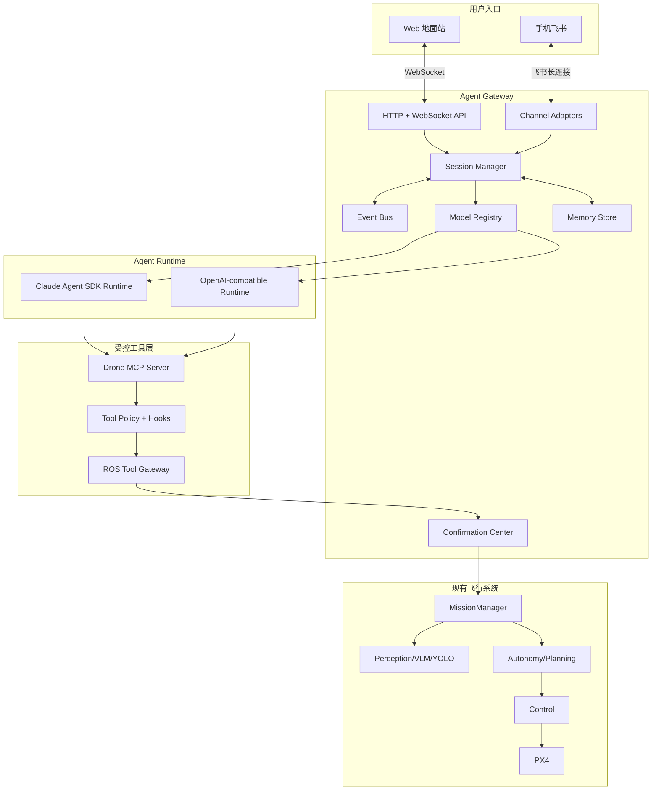

# Claude Agent SDK 多端智能无人机系统升级技术方案

> 文档状态：设计稿 1.0  
> 适用项目：当前 ROS 2 + PX4 + Web 地面站无人机系统  
> 核心目标：实现 Web/飞书多端流式对话、历史记忆、模型切换，以及经过安全确认的自然语言无人机操作。

---

## 1. 结论

这套方案可以完整实现以下能力：

1. Web 端逐字流式回复，不再等待整个 ROS 服务调用结束后一次性显示。
2. 飞书手机端持续接收分析、工具调用、确认请求、任务进度和最终结果。
3. 每个用户和会话拥有独立上下文，服务重启后可恢复历史。
4. 支持 Claude 模型切换，并保留同一会话上下文。
5. 保留 DeepSeek、Qwen 等 OpenAI-compatible 模型作为可选 Runtime。
6. 大模型可以读取飞行状态、里程计、检测结果、图像分析和任务状态。
7. 用户可以通过对话创建、确认、执行、取消和查询无人机任务。
8. 大模型不能绕过安全层直接控制 PX4，也不能通过任意 Shell 调用飞控。

需要特别区分三种“记忆”：

| 类型 | 内容 | 保存方式 |
|---|---|---|
| 当前上下文 | 当前对话轮次、工具调用、模型回复 | Claude session + Gateway 活跃会话 |
| 历史会话 | 过去的完整对话和事件 | SQLite 消息与事件表 |
| 长期记忆 | 用户偏好、无人机配置、任务结论、重要事实 | 结构化 Memory Store + 摘要 |

Claude Agent SDK 能提供多轮 Agent 会话，但项目仍需自己保存可查询的聊天历史、跨模型上下文和长期记忆。

### 当前实现进度

- [x] 独立 `aeromind_agent_gateway` 包。
- [x] Claude Agent SDK 流式多轮会话。
- [x] SQLite 会话、消息、事件和 Claude session ID。
- [x] WebSocket 统一事件协议与 Web 流式显示。
- [x] Claude 会话内 `set_model()` 模型切换。
- [x] 只读 Drone MCP 工具。
- [x] 控制请求 MCP 工具，不直接执行 ROS 控制。
- [x] 持久化 Confirmation Center、用户绑定、过期和幂等。
- [x] 确认后复用现有 ROS Agent 安全检查与 MissionManager。
- [x] 飞书长连接、`open_id` 白名单、持久会话和消息去重。
- [x] 飞书文本任务、状态查询、模型切换和私聊文本确认。
- [x] 飞书 JSON 2.0 确认卡片、按钮回调和任务状态更新。
- [x] 飞书单条消息节流增量更新。
- [x] 飞书私聊图片下载、格式/大小校验、任务归档和 VLM 转发。
- [x] 飞书图片分析结果写入会话历史、任务报告和 Web 缩略图数据源。
- [x] Web/飞书显式操作员身份绑定与旧会话安全迁移。
- [x] 操作员级 Event Bus、跨端确认和持久化 Gateway Mission。
- [x] Mission 主动过期事件及 Web/飞书状态同步。
- [x] Gateway/ROS Mission 关联、命令受理阶段和物理完成遥测验证。
- [x] 持久化操作员级滚动记忆、跨端上下文和近期 Mission 注入。
- [x] 操作员统一聊天时间线、独立 Claude 语义摘要和可治理长期记忆。
- [x] Claude/OpenAI 兼容 Runtime、跨 Provider 切换和 SQLite 上下文迁移。
- [x] 通用白名单 Workflow、依赖/条件/重试与单次人工确认。
- [x] Workflow 暂停、恢复、取消、步骤进度和重启安全中止。
- [x] Gateway 模块化技能注册、技能目录 API 与 Web 合并展示。

---

## 2. 当前系统基线

当前项目已经具备：

- ROS 2 模块：Agent、Perception、Autonomy、Planning、Control、Bridge、Web。
- PX4 原生解锁、起飞、降落、RTL 返航和 Offboard 控制。
- RGB、Depth、LiDAR、YOLO、VLM 图像分析。
- 自主目标、轨迹执行、局部避障、恢复策略和状态反馈。
- Skills 技能目录和复合任务 MissionManager。
- 高风险控制动作的确认令牌。
- Web 遥测、相机、点云、检测、任务进度和报告展示。

当前 Agent 链路为：

```text
Web POST /api/agent/chat
  -> web_console_node
  -> ROS /agent/execute_task
  -> agent_node 单次 LLM 解析
  -> Skill/MissionManager
  -> ROS Control/Autonomy
```

主要限制：

- `/api/agent/chat` 仍是一次请求和一次完整响应，并非流式 Agent 会话。
- 前端传入的 `session_id` 和 `history` 没有在 Web 后端形成真正会话。
- `/ws` 当前主要单向推送遥测，不能承载双向聊天和确认事件。
- `agent_node` 同时承担解析、技能执行、确认和任务状态，职责过重。
- 待确认任务只保存在内存，进程重启后丢失。
- LLM 配置是 ROS 启动参数，不能安全地按用户会话动态切换。
- Web 与未来飞书入口如果分别实现控制逻辑，会产生权限和状态不一致。

---

## 3. 设计原则

### 3.1 大模型负责高层智能

大模型负责：

- 理解自然语言和多轮指代。
- 获取并解释 ROS 状态。
- 拆解多步骤任务。
- 选择 Skills 和工具。
- 根据工具结果调整计划。
- 解释风险、失败原因和任务结果。
- 生成任务报告和后续建议。

### 3.2 确定性模块负责飞行安全

大模型不负责：

- 电机、姿态和高频速度闭环。
- 直接发布 PX4 uORB 控制消息。
- 绕过用户确认执行高风险操作。
- 决定急停是否有效。
- 使用任意 Bash 命令执行 ROS 控制。

最终执行权保持为：

```text
SafetySupervisor
  -> MissionManager
  -> Autonomy/Planning
  -> Control
  -> PX4
```

### 3.3 所有入口共享同一 Agent Core

Web、飞书和后续移动 App 只是 Channel Adapter，不能各自维护一套 Agent：

```text
Web Adapter ----+
                +-> Agent Gateway -> Session/Model/Tools/Safety
Feishu Adapter -+
```

---

## 4. 总体架构



---

## 5. 新增软件包和目录

建议新增独立 Python 包，不直接把异步 SDK 放进现有 `agent_node.py`：

```text
src/aeromind_agent_gateway/
  aeromind_agent_gateway/
    main.py
    config.py
    api/
      http_routes.py
      websocket.py
      schemas.py
    adapters/
      base.py
      web.py
      feishu.py
    runtime/
      base.py
      claude.py
      openai_compatible.py
    sessions/
      manager.py
      context.py
      summarizer.py
    memory/
      store.py
      models.py
      repository.py
    tools/
      drone_mcp.py
      ros_gateway.py
      schemas.py
      policy.py
    safety/
      confirmation.py
      permissions.py
      audit.py
    events/
      bus.py
      models.py
    channels/
      feishu_cards.py
  config/
    models.yaml
    permissions.yaml
  setup.py
  package.xml
```

进程职责划分：

| 进程 | 职责 |
|---|---|
| `agent_gateway` | 异步会话、SDK、模型、记忆、WebSocket、飞书 |
| `agent_node` | MissionManager 和确定性 ROS 任务执行 |
| `web_console_node` | 遥测、相机、点云、报告和 ROS 数据聚合 |
| `control_node` | 飞行控制和 PX4 命令 |
| `autonomy_node` | 轨迹、避障、重规划和恢复 |

---

## 6. 流式对话设计

### 6.1 WebSocket 地址

建议新增：

```text
ws://<host>:8090/ws/agent?token=<access-token>
```

8080 端口可继续提供现有地面站静态页面和遥测；8090 由 Agent Gateway 提供双向 Agent 通道。后续可通过反向代理统一为一个端口。

### 6.2 客户端消息

发送自然语言：

```json
{
  "type": "chat.send",
  "request_id": "req-001",
  "session_id": "session-001",
  "content": "检查状态，如果安全就起飞到10米",
  "channel": "web"
}
```

确认执行：

```json
{
  "type": "confirmation.respond",
  "request_id": "req-002",
  "session_id": "session-001",
  "confirmation_id": "confirm-001",
  "decision": "approve"
}
```

切换模型：

```json
{
  "type": "model.switch",
  "session_id": "session-001",
  "provider": "claude_official",
  "model": "sonnet"
}
```

### 6.3 服务端事件

```text
chat.accepted
assistant.started
assistant.delta
assistant.completed
tool.started
tool.progress
tool.completed
confirmation.required
confirmation.resolved
mission.created
mission.updated
mission.completed
model.changed
session.updated
error
```

流式文字事件示例：

```json
{
  "type": "assistant.delta",
  "session_id": "session-001",
  "message_id": "msg-1002",
  "delta": "正在读取无人机状态"
}
```

工具调用事件示例：

```json
{
  "type": "tool.started",
  "session_id": "session-001",
  "tool_call_id": "tool-003",
  "tool": "get_drone_state",
  "arguments": {}
}
```

所有事件必须包含单调递增的 `sequence`，客户端断线重连后可从最后一个序号继续拉取，避免任务进度丢失。

### 6.4 背压和断线处理

- 每个连接使用有界发送队列。
- 遥测与 Agent 事件分通道，避免点云数据阻塞聊天。
- `assistant.delta` 可合并为 50 至 100 ms 一批发送。
- 断线不取消 Agent 任务，除非用户明确发出取消命令。
- 重连后先返回会话快照，再继续实时事件。

---

## 7. 会话历史与长期记忆

### 7.1 会话标识

统一内部标识：

```text
user_id     系统用户
channel     web / feishu
channel_id  浏览器客户端或飞书 open_id
session_id  对话会话
mission_id  飞行任务
```

飞书和 Web 可以绑定同一系统用户，但默认使用独立会话，避免手机和演示电脑同时修改同一个上下文。

### 7.2 SQLite 数据结构

第一阶段使用 SQLite，后续多人部署再迁移 PostgreSQL。

```sql
users(
  id, display_name, role, enabled, created_at
)

channel_bindings(
  id, user_id, channel, external_id, created_at
)

sessions(
  id, user_id, title, provider, model,
  runtime_session_id, status, created_at, updated_at
)

messages(
  id, session_id, role, content_json,
  model, token_usage_json, created_at
)

events(
  id, session_id, sequence, type, payload_json, created_at
)

confirmations(
  id, session_id, user_id, action_json, risk_level,
  status, expires_at, resolved_at
)

memories(
  id, user_id, scope, key, value_json,
  source_session_id, confidence, updated_at
)

mission_links(
  id, session_id, mission_id, created_at
)
```

### 7.3 三层记忆策略

1. 活跃窗口：最近若干轮完整消息和工具结果。
2. 会话摘要：上下文达到阈值时生成摘要，保留目标、约束、已完成动作和未完成事项。
3. 长期事实：只保存明确、稳定且有来源的事实，例如默认起飞高度、常用目标类别和安全限制。

不应写入长期记忆：

- 临时遥测值。
- 未经确认的模型推测。
- API Key 和飞书凭证。
- 未经用户允许的敏感身份信息。

### 7.4 Claude 会话恢复

保存 Claude SDK 返回的原生 session ID。恢复时：

```text
读取系统 session
  -> 找到 runtime_session_id
  -> ClaudeAgentOptions(resume=runtime_session_id)
  -> 恢复 Claude 上下文
  -> Web 历史仍从本地 SQLite 读取
```

本地数据库是界面历史和审计的事实来源，Claude session 只负责模型上下文恢复。

---

## 8. 模型与 Provider 切换

### 8.1 模型注册表

```yaml
providers:
  claude_official:
    runtime: claude_agent_sdk
    api_key_env: ANTHROPIC_API_KEY
    models:
      - alias: sonnet
        model: claude-sonnet-4-6
        purpose: general
      - alias: opus
        model: claude-opus-4-6
        purpose: complex_planning
      - alias: haiku
        model: claude-haiku-4-5
        purpose: summary

  deepseek:
    runtime: openai_compatible
    api_key_env: DEEPSEEK_API_KEY
    base_url: https://api.deepseek.com/v1
    models:
      - alias: deepseek
        model: deepseek-chat
        purpose: fallback
```

实际模型 ID 在实施时以供应商当前可用模型为准，不在前端硬编码。

### 8.2 同 Runtime 切换

当前 Claude Agent SDK 的流式 `ClaudeSDKClient` 已提供 `set_model()`。优先在现有会话内原生切换：

```text
暂停接收本会话新消息
  -> 等待当前 turn 完成或用户中断
  -> await client.set_model(new_model)
  -> 更新数据库中的会话模型
  -> 写入 model.changed 事件
  -> 恢复接收消息
```

只有 SDK 连接失效或目标 Provider 不能在当前 Client 中切换时，才关闭 Client，并使用保存的 `runtime_session_id` 和新模型恢复会话。CCConnect 的“进程重建 + resume”方式作为兼容回退，而不是当前 Claude Runtime 的默认路径。

模型切换只影响当前 `session_id`，不能默认影响项目中所有用户。

### 8.3 跨 Runtime 切换

Claude 切换到 DeepSeek/Qwen 时不能继续使用 Claude 原生 session。采用：

```text
读取本地历史
  -> 生成受控会话摘要
  -> 加载最近 N 轮关键消息
  -> 创建新 Runtime 会话
  -> 标记 context_migrated=true
```

界面需要提示“上下文已迁移”，不能伪装成原生无损恢复。

### 8.4 密钥管理

- API Key 通过环境变量或权限为 `0600` 的服务端配置文件提供。
- Web API 只返回 `configured: true/false`，不返回密钥内容。
- 飞书 App Secret 不能写入任务报告和日志。
- 日志统一执行密钥脱敏。

---

## 9. Claude Agent SDK 集成

### 9.1 Runtime 接口

```python
class AgentRuntime:
    async def start(self, session): ...
    async def send(self, message): ...
    async def events(self): ...
    async def interrupt(self): ...
    async def close(self): ...
```

`ClaudeRuntime` 和 `OpenAICompatibleRuntime` 实现相同接口，Gateway 不直接依赖具体模型 SDK。

### 9.2 Claude 配置建议

```python
options = ClaudeAgentOptions(
    model=model_id,
    cwd=workspace,
    tools=[],
    mcp_servers={"drone": drone_mcp_server},
    allowed_tools=[
        "mcp__drone__get_drone_state",
        "mcp__drone__get_perception_summary",
        "mcp__drone__get_mission_status",
    ],
    max_turns=12,
    max_budget_usd=session_budget,
    hooks=tool_policy_hooks,
)
```

核心要求：

- 不启用通用 Bash 飞控能力。
- 不允许模型直接修改控制节点源码后立即运行。
- 使用结构化工具参数，不从模型文本中拼接 Shell。
- 对工具调用设置超时、取消和审计。
- Agent 系统提示中明确坐标系、单位、风险规则和执行边界。

---

## 10. Drone MCP 工具设计

### 10.1 只读工具

| 工具 | 返回内容 | 权限 |
|---|---|---|
| `get_drone_state` | armed、mode、battery、GPS、EKF | 自动 |
| `get_odometry` | ENU 位置、速度、高度、航向 | 自动 |
| `get_autonomy_status` | goal、距离、障碍、策略 | 自动 |
| `get_perception_summary` | RGB、深度、点云、检测 | 自动 |
| `analyze_camera` | VLM 场景、风险、建议 | 自动但限频 |
| `get_mission_status` | 当前步骤、进度、失败原因 | 自动 |
| `list_skills` | 可用能力及风险等级 | 自动 |

### 10.2 计划工具

| 工具 | 作用 |
|---|---|
| `create_mission_plan` | 生成结构化任务步骤，不执行 |
| `validate_mission` | 检查参数、状态和能力可用性 |
| `estimate_mission_risk` | 输出风险项和确认要求 |
| `generate_mission_report` | 生成当前或历史任务报告 |

### 10.3 控制请求工具

| 工具 | 风险 | 默认处理 |
|---|---|---|
| `request_arm` | 高 | 必须确认 |
| `request_takeoff` | 高 | 必须确认 |
| `request_move` | 高 | 必须确认 |
| `request_land` | 高 | 必须确认 |
| `request_return_home` | 高 | 必须确认 |
| `request_cancel_mission` | 中 | 操作员确认或策略允许 |
| `request_emergency_stop` | 极高 | 独立安全入口 |

控制请求工具只创建 `confirmation`，不能直接执行 ROS 服务。

### 10.4 ROS Tool Gateway

工具层调用现有 ROS 接口：

```text
get_drone_state          <- /control/drone_state
get_odometry             <- /sensor/odometry
get_perception_summary   <- RGB/Depth/PointCloud/Detections
analyze_camera           -> /perception/analyze_image
create_mission_plan      -> MissionManager
request_takeoff          -> ActionRequest -> /control/takeoff
request_move             -> ActionRequest -> /autonomy/goal
request_land             -> ActionRequest -> /control/land
request_return_home      -> ActionRequest -> /control/return_home
```

建议逐步把长时间任务从 ROS Service 升级为 ROS Action，获得反馈、取消和最终结果语义。短状态查询仍使用 Topic/Service。

---

## 11. 确认和安全系统

### 11.1 两阶段执行

```text
阶段 1：模型提出动作
  -> 参数校验
  -> 状态检查
  -> 风险评估
  -> 创建 confirmation

阶段 2：用户确认
  -> 校验用户和会话
  -> 校验有效期和当前状态
  -> 获取飞行器控制锁
  -> 执行 Mission
  -> 根据遥测验证结果
```

### 11.2 确认记录

```json
{
  "id": "confirm-001",
  "session_id": "session-001",
  "user_id": "operator-01",
  "action": "takeoff",
  "args": {"altitude": 10.0},
  "risk_level": "high",
  "status": "pending",
  "expires_at": "2026-07-14T12:01:00Z"
}
```

必须满足：

- 令牌一次性使用。
- 默认 60 秒过期。
- 只能由创建请求的用户或更高权限操作员确认。
- 执行前重新读取飞行状态，不能只使用解析时的旧状态。
- 相同飞行器同一时间只能有一个控制任务。
- 所有确认、取消、过期和执行结果写入审计日志。

### 11.3 急停边界

急停按钮和底层 failsafe 不依赖大模型或 Agent 会话。Web 和飞书可以触发急停请求，但最终逻辑必须在独立 SafetySupervisor 中实现。

---

## 12. 飞书手机端设计

### 12.1 接入方式

采用飞书自建应用机器人和 SDK 长连接：

```text
飞书客户端
  -> 飞书开放平台
  -> WSL Agent Gateway 主动建立的 WebSocket 长连接
```

本地 WSL 需要访问公网，但不需要公网 IP、域名和 Webhook 内网穿透。

### 12.2 消息处理

- 订阅 `im.message.receive_v1`。
- 使用 `message_id` 做幂等去重。
- 单聊直接处理，群聊仅处理 `@机器人`。
- 只允许白名单用户执行控制类工具。
- 图片消息可转入 VLM 分析，但需要大小和类型限制。
- 将飞书 `open_id` 映射为内部 `user_id`。

### 12.3 回复方式

第一版：

- 立即回复“任务已接收”。
- 工具阶段发送简短进度消息。
- 高风险任务发送确认编号。
- 最终发送任务结果和报告链接。

```text
/confirm confirm-001
/cancel confirm-001
/status
/model sonnet
/new
```

第二版：

- 使用交互卡片显示状态、参数、风险和确认按钮。
- 更新同一张任务卡片，减少消息刷屏。
- 支持任务报告、截图和检测结果图片回传。

### 12.4 多端一致性

飞书发起任务后，Web 应实时出现同一个 Mission；Web 确认后，飞书也应收到 `confirmation.resolved` 和后续进度。两端通过统一 Event Bus 和数据库实现，不做点对点同步。

---

## 13. 权限模型

| 角色 | 能力 |
|---|---|
| `viewer` | 查看状态、相机摘要、历史报告 |
| `operator` | 创建任务、确认普通飞行操作、取消任务 |
| `admin` | 用户管理、模型配置、权限配置、系统维护 |

附加约束：

- 真机模式比仿真模式使用更严格的动作范围。
- 飞书群聊默认只提供查询能力。
- 模型切换和 API Provider 配置只允许管理员。
- `bypassPermissions` 不能用于真实飞行部署。

---

## 14. 配置方案

```yaml
gateway:
  host: 0.0.0.0
  port: 8090
  database: ~/.drone_console/agent.db
  access_token_env: DRONE_GATEWAY_TOKEN

sessions:
  idle_timeout_minutes: 30
  max_active_sessions: 20
  history_window_messages: 30
  summary_threshold_tokens: 50000

safety:
  confirmation_ttl_seconds: 60
  require_confirmation:
    - arm
    - takeoff
    - move
    - land
    - return_home
  max_takeoff_altitude_m: 30.0
  max_relative_move_m: 100.0

feishu:
  enabled: false
  app_id_env: FEISHU_APP_ID
  app_secret_env: FEISHU_APP_SECRET
  allowed_open_ids: []
  group_control_enabled: false
```

配置文件保存非敏感策略，密钥只引用环境变量名。

---

## 15. 实施阶段

### 阶段 0：接口冻结和回归基线

任务：

- 记录现有 ROS Topic、Service 和消息契约。
- 为起飞、降落、移动、RTL、检测和复合任务建立回归用例。
- 保存一套 AirSim/PX4 演示基线日志。

验收：升级前现有功能都有可重复测试入口。

### 阶段 1：Agent Gateway 与持久会话

任务：

- 创建 `aeromind_agent_gateway`。
- 接入 SQLite。
- 实现用户、会话、消息和事件模型。
- 实现双向 WebSocket 和断线重连。
- Web 对话改为 Gateway，不再直接调用一次性 `/agent/execute_task`。

验收：刷新网页和重启 Gateway 后仍可查看历史对话。

### 阶段 2：Claude Agent SDK 与流式回复

任务：

- 实现 `ClaudeRuntime`。
- 转换 SDK 消息为统一事件。
- 实现中断、超时、预算限制和错误降级。
- 暂时只开放只读 MCP 工具。

验收：Web 可实时显示回复和工具调用；“刚才高度是多少”可理解上下文。

### 阶段 3：受控 Drone MCP 与确认中心

任务：

- 实现 ROS Tool Gateway。
- 接入状态、感知、任务和报告工具。
- 实现持久化确认记录。
- 控制工具全部使用两阶段执行。
- 将现有确认逻辑逐步迁移到统一 Confirmation Center。

验收：模型不能在没有有效用户确认的情况下触发真实控制服务。

### 阶段 4：模型切换与 Runtime 抽象

任务：

- 实现模型注册表。
- 支持 Claude 模型切换和 session resume。
- 保留 OpenAI-compatible Runtime。
- 实现跨 Runtime 上下文摘要迁移。
- Web 显示当前 Provider、模型、耗时和用量。

验收：Claude 模型切换后继续当前对话；跨 Provider 切换有明确迁移提示。

### 阶段 5：飞书查询与流式进度

任务：

- 创建飞书应用和权限。
- 接入 SDK 长连接和消息去重。
- 完成用户绑定、白名单和群聊策略。
- 支持状态、感知、报告和任务进度。

验收：手机可查询无人机状态并接收 Agent 分析结果，不具备权限的用户不能控制。

### 阶段 6：飞书确认和无人机控制

任务：

- 支持文本确认和取消。
- 接入任务状态实时推送。
- 再升级交互卡片确认。
- 实现 Web 与飞书跨端状态一致。

验收：飞书发送“检查状态，安全就起飞到 5 米”，确认前不执行，确认后完整反馈任务状态。

### 阶段 7：工程化与真机加固

任务：

- 任务控制锁、限流、幂等、审计和断线恢复。
- ROS Action 化长时间任务。
- Agent、飞书、ROS 和 PX4 的健康检查。
- 仿真和真机权限配置分离。
- 故障注入、网络中断和模型不可用测试。

验收：模型或网络断开不影响 PX4 当前安全状态，急停和 failsafe 始终可用。

### 阶段 8：通用任务编排与技能插件

当前已完成：

- 白名单步骤：安全检查、感知检查、解锁/加锁、起飞/降落、移动、RTL 和悬停。
- 最多 20 步、前向依赖校验、条件执行、失败策略和有限重试。
- 整个工作流一次确认，子飞行动作继续走 ROS Agent 与物理完成验证。
- SQLite 保存定义和执行快照；进程重启将执行中任务标记为安全中止。
- Web 显示步骤状态并支持暂停、恢复和取消。
- `flight.square` 技能与可配置 Python 技能模块注册机制。

验收：输入“飞一个边长 10 米的正方形”，模型创建单个确认请求；确认后四段移动按序完成，Web 与飞书持续收到进度，取消后不再启动后续步骤。

---

## 16. 测试方案

### 16.1 单元测试

- 模型别名解析和切换。
- 会话创建、恢复、归档和摘要。
- 飞书消息去重和用户映射。
- MCP 参数 Schema 校验。
- 确认令牌过期、重复确认和越权确认。
- 事件序号和断线补发。

### 16.2 集成测试

- Web -> Gateway -> Claude -> 只读 ROS 工具。
- 飞书 -> Gateway -> Claude -> 状态查询。
- Claude -> 控制请求 -> 确认 -> MissionManager。
- 模型切换 -> 会话恢复。
- Gateway 重启 -> 历史和待确认任务恢复。

### 16.3 仿真验收场景

1. “当前是否适合起飞？”只查询，不执行。
2. “检查状态，如果安全就起飞到 10 米。”必须确认后执行。
3. “继续向左飞 5 米。”正确引用当前任务和坐标约定。
4. “前方有人吗？如果有人就悬停并拍照。”形成多步骤任务。
5. 飞行中切换模型，不重复执行上一条控制工具。
6. 飞书和 Web 同时确认同一任务，只允许第一次有效确认。
7. 模型超时或崩溃时，无人机保持安全状态。
8. 网络断开后 Web 重连，任务进度完整恢复。

### 16.4 真机前门槛

- 仿真连续完成不少于 100 次标准任务。
- 所有高风险工具确认覆盖率为 100%。
- 未授权控制测试全部被拒绝。
- 网络、模型、Gateway 崩溃不影响急停和 PX4 failsafe。
- 限高、限距、地理围栏和最低电量策略通过测试。

---

## 17. 可观测性

每次对话和任务记录：

- `trace_id`、`session_id`、`mission_id`。
- Provider、模型和 Runtime。
- 首 token 延迟、总耗时和 token/cost。
- 工具参数摘要、开始时间、完成时间和结果。
- 确认用户、渠道、时间和状态。
- ROS 服务耗时、超时和最终遥测验证。
- 任务失败原因和恢复策略。

Web 增加 Agent 诊断区域：

```text
Gateway 状态
Claude SDK 状态
当前模型
上下文占用
MCP 工具状态
飞书长连接状态
ROS Tool Gateway 状态
活跃会话/任务数量
```

---

## 18. 风险与应对

| 风险 | 应对方案 |
|---|---|
| 模型产生错误工具参数 | JSON Schema、范围校验、状态复查 |
| 模型重复调用控制工具 | `tool_call_id` 幂等和飞行器控制锁 |
| 会话切换后重复执行 | 只迁移历史，不重放工具副作用 |
| 飞书事件重复 | 按 `message_id` 去重 |
| Gateway 重启 | SQLite 持久化会话、事件和确认 |
| 模型不可用 | 规则兜底、只读降级、禁止盲目执行 |
| 跨 Provider 历史损失 | 本地标准历史 + 摘要迁移 |
| WebSocket 堵塞 | 遥测与 Agent 事件分流、队列限长 |
| 真机误操作 | 角色权限、确认、限高限距、地理围栏 |
| Claude Code 工具权限过大 | 禁用通用工具，仅开放 Drone MCP |

---

## 19. 团队任务拆分

| 方向 | 主要工作 |
|---|---|
| Agent Gateway | WebSocket、Event Bus、会话、Runtime 生命周期 |
| Claude/模型 | Claude SDK、模型注册表、切换、摘要和成本 |
| ROS Tools | MCP 工具、ROS 适配、Action/Service、Schema |
| Safety | 用户权限、确认中心、控制锁、审计和急停边界 |
| 飞书 | 应用配置、长连接、消息、卡片和用户绑定 |
| Web | 流式对话、会话列表、模型选择、工具与确认 UI |
| 测试 | AirSim 场景、故障注入、回归和真机准入 |

模块间只通过已经定义的事件、工具和 ROS 契约集成，团队成员可以并行开发。

---

## 20. 推荐的首个开发迭代

第一个迭代只完成以下闭环：

```text
Web 发送消息
  -> Agent Gateway 建立持久会话
  -> Claude Agent SDK 流式回复
  -> 调用 get_drone_state MCP 工具
  -> Web 实时显示工具过程和最终回答
  -> 刷新页面后恢复历史
```

这个闭环不执行任何飞行控制，风险最低，却可以先验证最关键的 SDK、流式通信、会话历史和 ROS 工具链。验证完成后，再加入 `request_takeoff -> confirmation -> MissionManager` 的第一个控制闭环。

---

## 21. 最终验收目标

用户从 Web 或飞书输入：

```text
检查当前状态和前方环境。如果适合飞行，起飞到 10 米，向左飞 20 米，搜索人员，完成后悬停并生成报告。
```

系统应当：

1. 在同一多轮会话中理解任务。
2. 流式显示状态和环境检查。
3. 调用只读 ROS/VLM 工具收集证据。
4. 生成结构化 Mission Plan 和风险说明。
5. 在 Web 和飞书同时显示确认请求。
6. 确认前不产生任何飞行控制副作用。
7. 确认后由 MissionManager 分步执行。
8. 持续推送起飞、移动、检测、悬停和报告进度。
9. 阻塞或失败时安全悬停并解释原因。
10. 保存完整聊天、工具、确认、任务、截图和报告历史。
11. 服务重启后仍能查询历史任务和对话。
12. 模型切换不会重复执行已经完成的飞行动作。

达到以上目标后，系统才具备“可对话、可记忆、可调用工具、可安全控制无人机”的完整 Agent 能力，而不只是自然语言分类器。

---

## 22. 参考资料

- [Claude Agent SDK Python](https://github.com/anthropics/claude-agent-sdk-python)
- [CCConnect](https://github.com/chenhg5/cc-connect)
- [CCConnect 使用文档](https://github.com/chenhg5/cc-connect/blob/main/docs/usage.md)
- [飞书接收消息](https://open.feishu.cn/document/server-docs/im-v1/message/events/receive)
- [飞书发送消息](https://open.feishu.cn/document/server-docs/im-v1/message/create)
- [飞书长连接接收事件](https://open.feishu.cn/document/server-docs/event-subscription-guide/event-subscription-configure-/request-url-configuration-case?lang=zh-CN)
