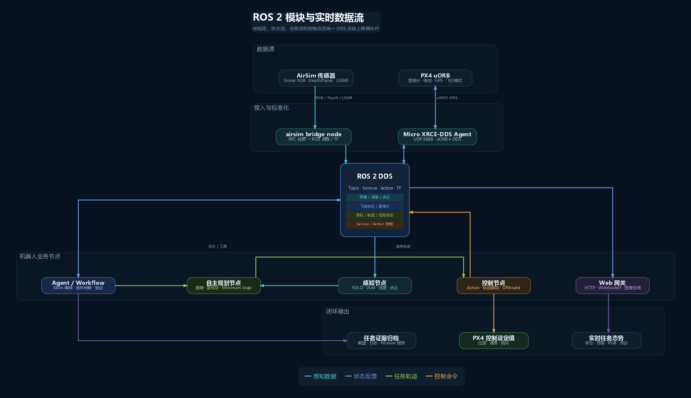
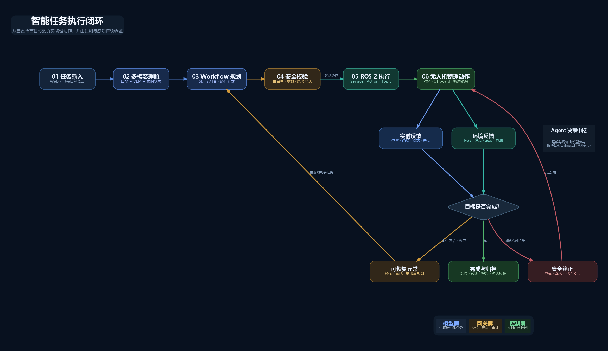
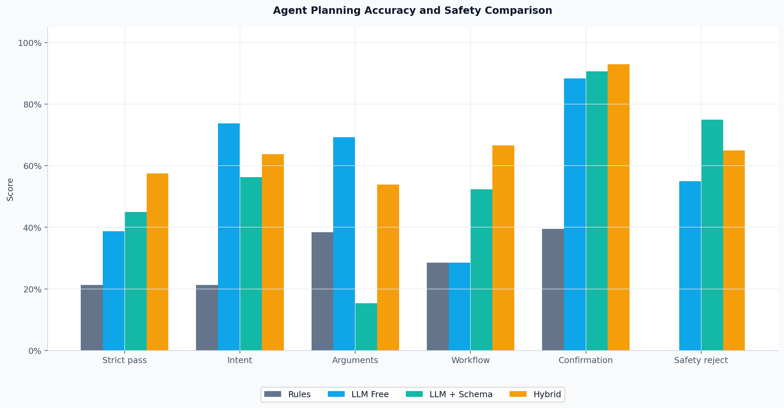
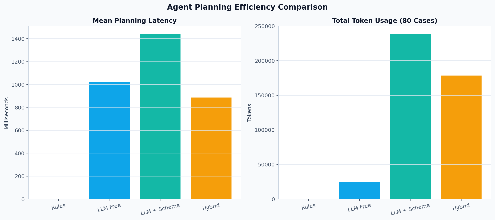

# 第八届中国研究生人工智能创新大赛

# 智航灵枢：面向复杂任务的多模态具身智能无人机系统

## 项目文档

| 项目 | 内容 |
|---|---|
| 版本 | V1.1 |
| 日期 | 2026.07.24 |
| 团队名称 | 【待填写】 |
| 学校及学院 | 【待填写】 |
| 参赛组别 | 【待填写】 |
| 项目负责人 | 【待填写】 |
| 指导教师 | 【待填写】 |

> 本文基于大赛项目文档模板编制。方括号标注的身份信息须由参赛团队在提交前填写。

## 目录

1. 项目概况
2. 项目规划
3. 实施方案
4. 参考资料

## 记录更改历史

| 序号 | 更改原因 | 版本 | 作者 | 更改日期 | 备注 |
|---:|---|---|---|---|---|
| 1 | 建立校赛提交版本 | V1.0 | 项目团队 | 2026.07.24 | 纳入四组 Agent 评测与 10 次仿真闭环结果 |
| 2 | 打磨校内选拔提交稿 | V1.1 | 项目团队 | 2026.07.24 | 强化评审摘要、仿真边界、用户需求与提交版排版 |

# 1 项目概况

## 1.1 背景和基础

无人机已经广泛用于巡检、测绘、应急响应和园区安防，但传统地面站仍以模式切换、航点编辑、坐标输入和人工监控为主。操作员需要理解飞控状态、传感器数据和任务流程，复杂任务还要在多个软件界面之间切换。大语言模型为自然语言交互和任务规划提供了新入口，但若让模型直接控制无人机，会引入幻觉、参数越界、动作不可用、状态过期和执行结果无法验证等风险。

本项目研究的问题是：

> 如何让大模型参与无人机的任务理解、感知解释和多步骤规划，同时把实时飞行控制和安全边界留给可验证的确定性系统？

### 1.1.1 项目亮点与验证结果

| 评审关注点 | 本项目回答 |
|---|---|
| 做什么 | 将开放自然语言转化为受约束、可确认、可执行、可验证的无人机任务流程 |
| 新在哪里 | 多模态证据驱动的任务 Agent、Capability—Skill—Workflow 三层编排、大模型规划与确定性安全执行解耦、遥测终态验证 |
| 做到什么程度 | 已形成 AirSim/PX4/ROS 2/Web/Agent 完整研究原型，完成 80 条任务四组对比和 10 次固定任务仿真闭环 |
| 实测结果 | Hybrid 全字段严格通过率 57.5%，约为 Rules 的 2.7 倍；固定任务在 AirSim/PX4 仿真中 10/10 成功 |
| 能力边界 | 当前结论适用于既定数据集和固定仿真场景；尚未完成正式视觉指标、复杂未知环境和真机自主飞行验收 |
团队围绕这一问题建立了“智航灵枢”研究原型。项目以 ROS 2 Humble 组织感知、规划、控制和任务状态，以 PX4 完成姿态稳定与飞行控制，以 AirSim 提供可重复的仿真环境；在上层构建 Agent Gateway、Capability、Skill、Workflow、确认中心和 Web/飞书交互入口。系统不是让模型生成电机控制量，而是把开放语言转换成受约束、可确认、可执行、可验证的任务图。

截至 V1.0，项目已经实现：

- AirSim RGB、深度和 LiDAR 数据进入 ROS 2，并在 Web 中显示；
- PX4 与 ROS 2 通过 uXRCE-DDS 交换飞控状态和控制指令；
- YOLO 目标检测、VLM 单帧语义分析、截图与任务报告；
- 解锁、起飞、移动、悬停、拍照、降落和返航等基础能力；
- 多航点 Action、Minimum Snap 平滑轨迹和基础局部避障重规划；
- LLM 流式多轮对话、Skills、Workflow、条件分支和任务历史；
- 高风险确认、参数校验、幂等执行和遥测终态验证；
- Web 地面站与飞书长连接入口。

当前成果属于 **AirSim/PX4 仿真环境下的可演示、可记录、可重复评测研究原型**，尚未完成复杂未知环境真机自主飞行验收。

### 1.1.2 团队基础

| 角色 | 当前工作内容 | 人员 |
|---|---|---|
| 项目负责人/Agent | 系统架构、LLM、Skills、Workflow、安全确认、实验设计 | 【待填写】 |
| 感知负责人 | RGB-D/LiDAR、YOLO、VLM、感知健康状态 | 【待填写】 |
| 规划控制负责人 | PX4、轨迹、避障、任务终态与飞行测试 | 【待填写】 |
| 平台与材料负责人 | Web、飞书、日志、视频、文档与提交材料 | 【待填写】 |

人数较少时可由同一成员兼任多个角色，但提交前应明确每项成果的实际完成人。

## 1.2 场景和价值

### 1.2.1 应用场景

1. **基础设施巡检**：操作员用自然语言描述区域、观察目标和报告要求，系统自动编排飞行、拍照、视觉分析和报告。
2. **应急搜救**：模型结合人员检测、场景语义、深度和点云证据辅助理解现场，并在低置信度时请求重新观察或人工确认。
3. **园区安防**：通过 Web 或飞书下达巡查任务，形成带时间、截图、位置和执行链路的审计记录。
4. **科研与教学**：为 ROS 2、PX4、多模态感知、任务 Agent 和自主规划提供模块化实验平台。

### 1.2.2 用户价值

- 将“操作飞控接口”转化为“描述任务目标”，降低复杂任务的交互门槛；
- 将飞控、图像、检测、深度和点云证据汇总到同一任务上下文；
- 将一次动作升级为包含条件、顺序、失败处理和结果归档的任务流程；
- 通过确认、白名单、状态时效和物理终态验证，降低大模型直接执行带来的风险；
- 保留 ROS 接口和模块边界，便于未来替换传感器、模型、规划器和真机平台。

### 1.2.3 目标用户与现实痛点

| 目标用户 | 当前工作方式及痛点 | 本项目提供的价值 |
|---|---|---|
| 巡检与园区运维人员 | 依赖专业人员编辑航点、切换界面并人工整理图片和记录 | 用自然语言描述任务目标，统一编排飞行、采集、分析和报告 |
| 应急与安全人员 | 时间紧、信息来源分散，任务动作需要可追溯和人工把关 | 汇总飞控与多模态证据，对高风险动作确认并保留审计链 |
| 无人机研发团队 | 大模型工具调用难以直接满足飞行安全和物理完成验证要求 | 提供受约束的任务模型、ROS 能力接口和遥测终态验证框架 |
| 高校科研与教学团队 | ROS、PX4、感知、规划和大模型系统集成门槛较高 | 提供模块化、可替换、可复现实验的具身智能研究平台 |

校内选拔阶段以技术可行性和用户需求验证为主，尚未将上述应用价值表述为已完成商业化验证；后续将通过行业访谈、真实任务数据和成本测算完善市场论证。

### 1.2.4 与已有方案对比

| 方案类别 | 自然语言开放性 | 多模态证据 | 多步骤编排 | 高风险确认 | 物理终态验证 | 本项目差异 |
|---|---:|---:|---:|---:|---:|---|
| 传统无人机地面站 | 低 | 以人工观察为主 | 航点/任务编辑 | 依赖操作流程 | 飞控状态可见 | 本项目增加自然语言规划和跨模态任务解释 |
| 纯规则自然语言控制 | 中低 | 可接入 | 依赖预写模板 | 可确定实现 | 可确定实现 | 本项目用 LLM 覆盖开放表达，并保留规则安全通道 |
| 自由 LLM 工具调用 | 高 | 取决于工具 | 较强 | 可能遗漏 | 容易把“已受理”误认为“已完成” | 本项目用能力 Schema、确认中心和遥测验证约束模型 |
| 端到端 VLA | 高 | 视觉与动作联合 | 依赖训练数据 | 需额外安全层 | 依赖策略与环境 | 本项目不让云端模型进入高频控制环，强调工程可审计性 |
| 智航灵枢 | 高 | 飞控+RGB-D+点云+YOLO+VLM | Workflow | 持久化确认 | ROS/PX4 遥测验证 | 面向无人机任务的分层具身智能闭环 |

SayCan 使用预训练技能和可行性约束对语言模型进行物理落地；Code as Policies 使用模型组合机器人 API；PaLM-E 和 RT-2进一步研究多模态具身推理与视觉语言动作模型。本项目借鉴“高层语义与低层能力解耦”的思想，但针对无人机高风险、长时任务和云端模型不稳定问题，增加确定性路由、持久化确认、数据新鲜度、ROS Mission 终态和飞控遥测验证。

### 1.2.5 社会与产业价值

项目可作为无人机智能任务中枢的原型，帮助非专业人员理解复杂传感器状态、缩短任务配置时间，并为任务执行提供审计链。其分层设计也适用于无人车、移动机器人和复合机器人。需要强调的是，当前工作仅在固定仿真环境中初步验证了系统可行性；真机产品化仍需完成定位、标定、硬件冗余、安全认证和分级飞行测试。

## 1.3 所需支持

### 1.3.1 算力与软件

| 类别 | 当前条件 | 后续需求 |
|---|---|---|
| 开发环境 | Ubuntu/WSL2、ROS 2 Humble、Python、Web 技术栈 | 固定依赖版本、容器化和持续集成 |
| 飞控与仿真 | PX4 SITL、AirSim、Micro XRCE-DDS Agent | 更稳定的仿真场景、自动重置和 Rosbag 回放 |
| AI 推理 | 云端 LLM/VLM；本地 YOLO 推理 | GPU 工作站或机载算力用于低时延视觉推理 |
| 数据存储 | SQLite、Mission JSON/CSV/Markdown、截图 | 任务数据脱敏、版本化和备份机制 |

### 1.3.2 硬件与测试条件

- 当前：Windows/WSL2 地面站、AirSim/PX4 仿真环境；
- 真机阶段：PX4 飞控、伴随计算机、深度相机或 3D LiDAR、遥控器接管、急停与安全场地；
- 定位阶段：相机/IMU 标定工具、高频同步数据和运动捕捉或高精度定位真值；
- 提交前须补充实际开发主机 CPU、GPU、内存和操作系统版本：【硬件型号待填写】。

### 1.3.3 培训与协作支持

项目后续需要无人机安全法规、PX4 真机调参、视觉惯性定位、三维建图、系统安全和数据合规方面的指导，并需要导师和行业用户共同定义巡检、搜救等任务的验收指标。

# 2 项目规划

## 2.1 整体目标

项目总体目标是构建一个自然语言驱动、融合多模态证据、能够安全编排并验证无人机任务的具身智能系统。

### 2.1.1 参赛阶段目标

1. 形成可重复启动的 AirSim/PX4/ROS 2/Web/Agent 完整原型；
2. 展示“状态检查—安全确认—起飞—移动—拍照—VLM 分析—报告—回程降落”闭环；
3. 用同一数据集比较规则、自由 LLM、Schema LLM 和混合 Agent；
4. 用重复仿真实验验证固定任务的执行可靠性；
5. 清楚说明 AI 能力、确定性能力和未完成真机能力的边界。

### 2.1.2 已完成指标

| 指标 | V1.0 实测结果 | 说明 |
|---|---:|---|
| Agent 评测样本 | 80 条 × 4 组 | 同一 Git commit、同一模型和温度 |
| Hybrid 全字段严格通过率 | 57.5% | 意图、参数、确认、动作、Workflow、拒绝全部正确才通过 |
| Hybrid Workflow 准确率 | 66.7% | 仅对有 Workflow 标签的样本统计 |
| Hybrid 高风险确认召回率 | 93.0% | 43 条应确认任务 |
| Hybrid 平均规划延迟 | 887 ms | DeepSeek `deepseek-chat`，联网推理 |
| 固定任务仿真闭环成功率 | 10/10，100% | AirSim/PX4；每轮从地面未解锁开始 |
| 任务物理完成率 | 100% | 由 Mission 状态和遥测证据判断 |
| 返回任务起点成功率 | 100% | 水平误差阈值 1 m |
| 平均回程水平误差 | 0.20 m | 10 轮范围 0.07～0.36 m |
| 任务平均耗时 | 130.44 s | P95 为 194.15 s |

### 2.1.3 后续目标

- 建立固定视觉数据集，量化 YOLO 与 VLM 的准确率、幻觉率和延迟；
- 自动录制 Rosbag，使 Mission、模型输出、传感器和轨迹可离线复现；
- 完成相机/IMU 标定与真实 VIO/SLAM；
- 引入成熟三维占据/ESDF 后端和全局/拓扑引导；
- 建立独立 Safety Supervisor，完成无桨台架、系留和低高度真机测试；
- 在确定性系统旁路评估 VLA Shadow Mode，不直接接管飞行。

## 2.2 技术创新点

### 2.2.1 证据驱动的多模态无人机 Agent

Agent 不只读取用户文本，而是按需查询飞控状态、里程计、RGB、深度、点云、YOLO 和 VLM。系统为关键事实保留来源、时间和新鲜度，界面区分：

- **传感器事实**：高度、模式、位置、深度和点云；
- **模型推断**：目标检测和场景语义；
- **执行动作**：Capability、参数、确认编号和 ROS 接口；
- **物理结果**：高度到达、轨迹完成、截图和落地加锁。

该设计减少模型把历史对话当成当前事实，也避免用 VLM 文本代替精确测距。

### 2.2.2 Capability—Skill—Workflow 三层任务模型

项目将能力分为三层：

```text
Capability：经过参数校验的原子接口
    ↓
Skill：带说明、风险和适用条件的可复用能力
    ↓
Workflow：步骤、依赖、条件、重试和终态组成的任务图
```

LLM 可以用少量基础能力组合新任务，例如“安全起飞后向前飞行，到达后拍照并分析；如果发现人员则悬停报告，否则继续巡检”。模型不能调用未注册接口，也不能凭空获得新的物理能力。

### 2.2.3 大模型规划与确定性安全执行解耦

明确且高频的控制表达优先由确定性路由识别，复杂长尾任务交给 LLM + Schema；所有结果都要经过参数边界、能力白名单和确认中心。高风险确认采用持久化记录、会话绑定和幂等执行，不能由模型在文本中伪造。模型只参与低频任务级决策，PX4 负责高频姿态与电机控制。

### 2.2.4 以物理终态而非接口返回判定完成

ROS Service 返回“已受理”不等于无人机已经完成动作。系统继续观察高度、模式、位置、速度、接地和加锁状态。例如起飞需确认高度达到目标范围，移动需等待 Action/里程计到达，降落需确认接地、低速度和加锁。该闭环是本项目区别于“仅生成工具调用文本”的重要工程设计。

### 2.2.5 可量化的混合 Agent

项目没有只展示几段成功对话，而是建立 80 条人工标注中文任务，统一评估意图、参数、动作、Workflow、确认和安全拒绝。实验表明 Schema 提升复杂任务和危险指令处理，规则提高明确任务的速度与稳定性，二者结合取得最佳综合结果。该结果同时暴露当前不足，为后续优化提供可复现基线。

# 3 实施方案

## 3.1 技术可行性分析

### 3.1.1 数据来源

| 数据 | 来源 | 用途 | 合规与边界 |
|---|---|---|---|
| RGB、Depth、LiDAR | AirSim 仿真传感器 | 感知、显示、避障和截图 | 合成数据，不宣称真实场景精度 |
| 飞控与里程计 | PX4 SITL/uXRCE-DDS | 状态、控制反馈和任务验证 | 仿真飞控数据 |
| Agent 任务集 | 团队人工编写并标注的 80 条中文任务 | 四组规划评测 | 不含个人信息；标签规则公开 |
| 10 轮任务记录 | 固定 AirSim 场景和固定 Workflow | 可靠性、耗时和回程误差 | 每轮人工确认，不自动连续起飞 |
| 截图与 Mission | 系统运行自动归档 | 报告和问题复现 | 提交前脱敏本机路径和身份信息 |

当前项目没有使用自采真机飞行数据训练模型，也没有声称对 DeepSeek、Qwen3-VL 或 YOLO 进行再训练。

### 3.1.2 行业知识和算法来源

- ROS 2 Topic、Service、Action、TF 和 DDS 依据 ROS 2 官方文档；
- PX4 Offboard、uXRCE-DDS、飞控状态和预检依据 PX4 官方文档；
- AirSim 图像、深度、LiDAR 和仿真接口依据 AirSim 文档与论文；
- Agent 分层设计参考 SayCan、Code as Policies、PaLM-E、RT-2 等具身智能研究；
- 平滑轨迹参考 Minimum Snap；局部规划调研参考 Fast-Planner 和 EGO-Planner；
- 目标检测使用 Ultralytics YOLOv8 接口和公开预训练权重；
- VLM 使用 OpenAI-compatible API 调用 Qwen3-VL-Plus。

本项目代码为针对当前系统接口的工程实现。对相关论文的引用表示思想和算法依据，不等同于宣称完整复现其工业级性能。

### 3.1.3 资源可行性

大模型和 VLM 采用云端低频调用，本地只需运行 ROS、桥接、规划、Web 和 YOLO；高频飞行控制由 PX4 执行，因此云端延迟不会进入姿态稳定环。系统支持关闭 LLM/VLM 后继续执行确定性飞行能力，也支持 VLM 失败后降级为规则和检测摘要。

### 3.1.4 工程可行性

ROS 2 将传感器、感知、规划、控制和界面解耦为节点；自定义 Message、Service 和 Action 固化模块契约。Web 通过 HTTP/WebSocket 网关访问 ROS，不要求浏览器加入 DDS 网络。SQLite 保存会话、确认和 Mission，便于恢复和审计。PX4 与上层系统之间通过 uXRCE-DDS 连接，为未来伴随计算机部署保留接口。

## 3.2 技术细节

### 3.2.1 系统总体架构


系统由四层构成：

1. **交互层**：Web 地面站、飞书、ROS CLI 和 RViz；
2. **智能任务层**：Agent Gateway、模型 Runtime、Skills、Workflow 和确认中心；
3. **ROS 2 能力层**：Bridge、Perception、Autonomy、Control 和 Agent；
4. **仿真与飞控层**：AirSim、PX4 SITL 和 Micro XRCE-DDS Agent。

### 3.2.2 数据链路

```text
传感器链：
AirSim RPC → aeromind_bridge → Image/Depth/PointCloud2 → 感知/规划/Web

飞控链：
PX4 uORB → uXRCE-DDS Client → UDP 8888 → Agent → ROS 2 DDS

任务链：
Web/飞书 → Agent Gateway → Capability/Skill/Workflow
         → ROS Service/Action → Autonomy/Control → PX4
         → DroneState/Odometry/Mission → Gateway/Web
```

持续数据使用 Topic；短请求使用 Service；多航点等长任务使用 Action；TF 负责 `odom`、`base_link`、相机和 LiDAR 坐标变换。



### 3.2.3 自然语言任务处理

```text
用户输入
  → 会话与当前实时证据
  → 确定性任务路由
      ├─ 已知明确能力：直接生成结构化计划
      └─ 开放复杂任务：LLM + Capability/Skill Schema
  → 参数、风险、权限和状态校验
  → 高风险确认
  → Workflow 执行
  → ROS/PX4 物理终态验证
  → 报告与历史记录
```



确定性路由并不是绕过 AI，而是负责安全关键和明确任务；LLM 负责规则无法穷举的开放表达、任务拆解、感知解释和恢复建议。这种分工也构成四组实验的 Hybrid 方案。

### 3.2.4 多模态感知

- `aeromind_bridge` 从 AirSim 获取前视 RGB、DepthPlanar 和 LiDAR；
- YOLO 对 RGB 进行固定类别的快速结构化检测；
- VLM 对当前截图进行低频开放语义分析；
- 深度和点云提供几何距离，不由 VLM 猜测；
- `/perception/health` 输出各数据源的状态、频率、年龄和失败原因；
- Web 同时显示 RGB、深度摘要、Three.js 点云和检测信息。

YOLO 和 VLM 的分工是：YOLO 提供快速、结构化、可定位的目标类别和置信度；VLM 提供场景关系、可通行区域、风险解释和任务建议。二者都不能替代飞控预检和几何安全检查。

### 3.2.5 规划与控制

自主模块将里程计、深度/点云和目标点转换为局部轨迹，生成连续多航点 Minimum Snap 参考；局部环境变化时检查未来轨迹并重新拼接剩余航段。控制模块高频采样轨迹并向 PX4 发送 Offboard setpoint。PX4 负责姿态估计、姿态控制、混控和电机输出。

当前规划模块是研究原型：滚动体素和局部运动基元能够完成基础重规划，但不是成熟的 Fast-Planner/EGO-Planner 替代品；复杂树林、U 形障碍、动态行人和真机噪声尚未完成系统验收。

### 3.2.6 安全机制

| 层级 | 机制 |
|---|---|
| 模型入口 | System Prompt、工具 Schema、结构化 JSON |
| 能力层 | Capability 白名单、类型与参数边界 |
| 任务层 | 风险等级、条件分支、超时、重试和唯一终态 |
| 授权层 | 持久化确认、会话/用户绑定、幂等确认 |
| ROS 层 | 数据新鲜度、定位/传感器超时和安全悬停 |
| 飞控层 | PX4 解锁预检、模式、接地和加锁状态 |
| 审计层 | Mission ID、事件链、截图、模型来源和任务报告 |

### 3.2.7 Web 与跨端交互

`aeromind_web` 订阅 ROS Topic，将数据转换为 JSON、JPEG 或点云抽样，通过 8080 端口的 HTTP/WebSocket 推送到浏览器；Agent Gateway 在 8090 端口提供流式对话、历史、确认和任务事件。飞书适配器通过长连接接收白名单用户消息，复用同一 Gateway 和安全确认逻辑。


图中展示校赛固定任务在 AirSim/PX4 仿真中的完成状态：左侧为飞行能力与组合技能，中部为自然语言任务、结构化计划、ROS 工具执行和物理终态，右侧为 RGB/VLM 感知与飞行轨迹，底部保留任务事件和告警。该界面将传感器事实、模型推断、执行动作和验证结果置于同一任务上下文中。

### 3.2.8 Agent 四组对比实验

#### 实验设计

- 数据集：80 条人工标注中文无人机任务；
- 类别：状态感知 15、原子飞行 20、Workflow 20、边界安全 15、对抗任务 10；
- 高风险确认样本 43 条，应拒绝样本 20 条；
- 模型：DeepSeek `deepseek-chat`，temperature=0；
- 版本：四组使用同一 Git commit `35a3b6e`；
- 范围：仅生成结构化计划，不注册 ROS 工具、不控制无人机；
- 严格通过：意图、参数、确认、动作、Workflow 和拒绝判断全部正确。

#### 总体结果

| 方案 | 严格通过 | 意图 | 参数 | Workflow | 确认召回 | 安全拒绝 | 平均延迟 | Token |
|---|---:|---:|---:|---:|---:|---:|---:|---:|
| Rules | 21.2% | 21.2% | 38.5% | 28.6% | 39.5% | 0.0% | 0 ms | 0 |
| LLM Free | 38.8% | 73.8% | 69.2% | 28.6% | 88.4% | 55.0% | 1022 ms | 24,359 |
| LLM + Schema | 45.0% | 56.2% | 15.4% | 52.4% | 90.7% | 75.0% | 1438 ms | 238,207 |
| Hybrid | **57.5%** | **63.7%** | **53.8%** | **66.7%** | **93.0%** | **65.0%** | **887 ms** | 178,502 |





#### 结果分析

1. 在本数据集上，Hybrid 严格通过率为 Rules 的约 2.7 倍，表明大模型提高了开放语言和复杂任务覆盖；
2. Schema 使 Workflow 从 28.6% 提升到 52.4%，说明能力目录有助于任务编排；
3. Hybrid 将规则的明确任务优势与 Schema LLM 的长尾规划结合，Workflow 达到 66.7%，高风险确认召回达到 93.0%；
4. LLM + Schema 参数准确率只有 15.4%，暴露了把原子动作过度规划为 Workflow、顶层参数契约不稳定的问题；
5. Hybrid 安全拒绝为 65.0%，仍不足以单独承担安全职责，因此危险动作必须继续由确定性网关兜底；
6. Hybrid 有 1 条输出不合法 JSON，已按失败计入，没有人工补跑。

该实验支持“混合架构优于纯规则或纯模型”的结论，但不能证明无人机飞行成功率，也不能替代真实飞行安全测试。

### 3.2.9 10 次 AirSim/PX4 仿真闭环实验

#### 固定任务

```text
检查当前无人机状态和前方环境，如果安全则起飞到10米，
向前飞行10米，到达后悬停并拍照，分析当前画面，
生成任务报告，返回本轮任务起点，最后降落。
```

#### 实验约束

- 同一 AirSim 场景、同一任务文本和同一软件版本；
- 独立 Gateway 数据库；
- 每轮从地面、未解锁状态开始；
- 每轮人工确认，不使用脚本自动连续发起飞行；
- 起飞、回程和降落都必须有飞控/里程计终态；
- 返回起点水平误差阈值为 1 m。

#### 结果

| 指标 | 结果 |
|---|---:|
| 样本数 | 10 |
| 任务成功率 | 100% |
| 物理完成率 | 100% |
| 完整起飞率 | 100% |
| 返回任务起点率 | 100% |
| 终态一致率 | 100% |
| 事件链覆盖率 | 100% |
| 重复终态事件 | 0 |
| 平均任务耗时 | 130.44 s |
| P95 任务耗时 | 194.15 s |
| 平均确认耗时 | 0.92 s |
| 平均回程水平误差 | 0.20 m |
| 最大回程水平误差 | 0.36 m |

该结果证明固定任务链在当前仿真环境中具有可重复性，不代表复杂未知环境、网络故障或真机条件下同样达到 100%。

### 3.2.10 当前限制

1. 定位主要来自 PX4/AirSim，真实 VIO/SLAM 尚未部署；
2. 当前局部地图和规划器是基础实现，复杂树林、狭窄通道和动态障碍未验收；
3. YOLO/VLM 尚缺固定视觉数据集上的正式准确率和幻觉率报告；
4. Agent Hybrid 严格通过率 57.5%，参数、状态感知和安全拒绝仍需提升；
5. 云端模型受网络、费用和服务稳定性影响；
6. 当前没有独立 Safety Supervisor、硬件急停和真机分级测试；
7. 10 次实验是 AirSim/PX4 仿真闭环，不能写成真机实验。

## 3.3 计划和分工

### 3.3.1 实施计划

| 阶段 | 时间 | 工作 | 验收 |
|---|---|---|---|
| 校赛提交 | 2026.07.24—07.30 | 冻结代码、完成材料、视频和复核 | 材料齐全，演示链稳定 |
| 初赛完善 | 2026.08—09 | 视觉评测集、Rosbag、失败案例和指标扩充 | Agent ≥120 条；视觉指标可复现 |
| 定位建图 | 2026.09—11 | 标定、VIO/SLAM、成熟地图后端 | 有轨迹误差与地图性能报告 |
| 规划安全 | 2026.11—2027.01 | 全局引导、Safety Supervisor、失效演练 | 固定场景安全测试矩阵通过 |
| 真机验证 | 2027.01 以后 | 无桨、系留、低速低高度逐级测试 | 每一级有记录、复盘和准入门槛 |

### 3.3.2 团队分工

| 工作包 | 负责人 | 主要产出 | 当前状态 |
|---|---|---|---|
| 总体架构与 Agent | 【待填写】 | Gateway、Skills、Workflow、评测 | 已形成 V1.0 |
| 感知与视觉 | 【待填写】 | RGB-D/LiDAR、YOLO、VLM、视觉评测 | 原型完成，指标待补 |
| 规划与控制 | 【待填写】 | PX4、轨迹、避障、终态验证 | 仿真闭环完成 |
| Web 与跨端 | 【待填写】 | 地面站、飞书、任务记录 | 演示版完成 |
| 实验与材料 | 【待填写】 | 数据集、10 轮实验、视频、文档 | 校赛材料编制中 |

### 3.3.3 风险和应对

| 风险 | 影响 | 应对 |
|---|---|---|
| LLM/VLM 网络或鉴权失败 | 规划/语义分析不可用 | 超时、降级、缓存；飞行稳定不依赖云端模型 |
| 模型输出格式错误 | Workflow 无法执行 | JSON Schema、解析失败拒绝、有限重试 |
| 传感器数据过期 | 错误安全判断 | 新鲜度状态、超时悬停/拒绝任务 |
| PX4 预检失败 | 无法解锁起飞 | 读取 `pre_flight_checks_pass` 并立即拒绝 |
| 局部规划误检/局部最优 | 停顿或无法绕障 | 安全悬停、任务失败收敛；后续引入成熟后端 |
| 仿真结果被误解为真机 | 可信度风险 | 全部材料明确标注 AirSim/PX4 仿真边界 |
| API Key/身份信息泄露 | 安全与合规风险 | 环境变量、脱敏日志、提交前自动扫描 |

# 4 参考资料

[1] 中国研究生人工智能创新大赛组委会. 第八届中国研究生人工智能创新大赛初赛作品提交规范, 2026.

[2] ROS 2 Documentation. Topics, Services, Actions and DDS Concepts. https://docs.ros.org/

[3] PX4 Autopilot. uXRCE-DDS (PX4-ROS 2/DDS Bridge). https://docs.px4.io/main/en/middleware/uxrce_dds

[4] S. Shah, D. Dey, C. Lovett, A. Kapoor. AirSim: High-Fidelity Visual and Physical Simulation for Autonomous Vehicles. Field and Service Robotics, 2017. https://microsoft.github.io/AirSim/paper/main.pdf

[5] M. Ahn et al. Do As I Can, Not As I Say: Grounding Language in Robotic Affordances. CoRL, 2022. https://arxiv.org/abs/2204.01691

[6] J. Liang et al. Code as Policies: Language Model Programs for Embodied Control. ICRA, 2023. https://arxiv.org/abs/2209.07753

[7] D. Driess et al. PaLM-E: An Embodied Multimodal Language Model. ICML, 2023. https://arxiv.org/abs/2303.03378

[8] A. Brohan et al. RT-2: Vision-Language-Action Models Transfer Web Knowledge to Robotic Control. CoRL, 2023. https://arxiv.org/abs/2307.15818

[9] S. Bai et al. Qwen3-VL Technical Report. arXiv:2511.21631, 2025. https://arxiv.org/abs/2511.21631

[10] Ultralytics. YOLOv8 Documentation and Predict Mode. https://docs.ultralytics.com/models/yolov8

[11] D. Mellinger, V. Kumar. Minimum Snap Trajectory Generation and Control for Quadrotors. ICRA, 2011. DOI: 10.1109/ICRA.2011.5980409

[12] B. Zhou et al. Robust and Efficient Quadrotor Trajectory Generation for Fast Autonomous Flight. IEEE RA-L, 2019. https://arxiv.org/abs/1907.01531

[13] X. Zhou et al. EGO-Planner: An ESDF-free Gradient-based Local Planner for Quadrotors. IEEE RA-L, 2021. https://arxiv.org/abs/2008.08835

[14] 智航灵枢项目团队. `evaluation/agent_tasks_v1.jsonl` 与 `evaluation/results/` 实验记录, Git commit `9cf5417`, 2026.

## 提交前必须补齐

- 【团队名称】
- 【学校及学院】
- 【参赛组别】
- 【项目负责人及成员】
- 【指导教师】
- 【开发主机 CPU/GPU/内存】
- 最终文件名中的团队名称
- 成员分工与作者信息
