# 项目详细架构图与模块图

> 基线日期：2026-07-15  
> 阅读对象：刚开始学习 ROS 2、PX4、无人机自主系统和大模型 Agent 的项目成员  
> 图表格式：Mermaid。可使用 VS Code Markdown Preview Mermaid、Typora、Obsidian 或 GitHub 查看。

---

## 1. 一张图理解整个项目

```mermaid
flowchart LR
    USER[操作员] -->|自然语言、按钮、确认| UI[Web 地面站]
    UI <-->|HTTP 8080| WEB[ROS Web Console]
    UI <-->|WebSocket / HTTP 8090| GW[Agent Gateway]

    GW --> ROUTER[确定性路由 / LLM Runtime]
    ROUTER --> TASK[Skill + Workflow + Confirmation]
    TASK -->|ExecuteAction Service| AGENT[ROS Agent]

    AGENT -->|控制服务| CONTROL[Control Node]
    AGENT -->|目标 / 取消| AUTO[Autonomy Node]
    AGENT -->|拍照 / 图像分析| PERCEPTION[Perception Node]

    AIRSIM[AirSim] -->|RGB / Depth / LiDAR RPC| BRIDGE[AirSim Bridge]
    PX4[PX4] <-->|uXRCE-DDS| DDS[MicroXRCE-DDS Agent]
    DDS <-->|ROS 2 DDS Topics| BRIDGE
    DDS <-->|ROS 2 DDS Topics| CONTROL

    BRIDGE -->|Image / PointCloud / Odometry| PERCEPTION
    BRIDGE -->|Depth / PointCloud / Odometry| AUTO
    PERCEPTION -->|Detection / ImageAnalysis| AGENT
    PERCEPTION -->|语义建议| AUTO

    AUTO -->|Trajectory| CONTROL
    CONTROL -->|Offboard Setpoint / VehicleCommand| DDS
    PX4 -->|状态、位置、电池、EKF| DDS

    WEB -->|订阅 ROS 状态和传感器| BRIDGE
    WEB -->|状态、任务和图像| UI
    GW -->|流式文本、工具、进度| UI

    classDef human fill:#e8eef7,stroke:#45627d,color:#172638
    classDef web fill:#e3f0ed,stroke:#327367,color:#173a34
    classDef agent fill:#eee8f6,stroke:#76569a,color:#352444
    classDef ros fill:#e8eff8,stroke:#3e6d9c,color:#18344f
    classDef flight fill:#f5ece4,stroke:#9a6845,color:#4c2e1d
    class USER,UI human
    class WEB,GW web
    class ROUTER,TASK,AGENT agent
    class BRIDGE,PERCEPTION,AUTO,CONTROL,DDS ros
    class AIRSIM,PX4 flight
```

这张图可以分成五个层次：

1. **交互层**：用户、Web 地面站和飞书。
2. **智能层**：模型、Skill、Workflow、记忆和确认中心。
3. **ROS 2 能力层**：Agent、感知、自主规划和控制节点。
4. **通信桥接层**：AirSim API Bridge 与 MicroXRCE-DDS Agent。
5. **物理执行层**：PX4、仿真无人机和未来真实无人机。

---

## 2. 运行部署架构图

下面这张图说明各程序通常运行在哪里。

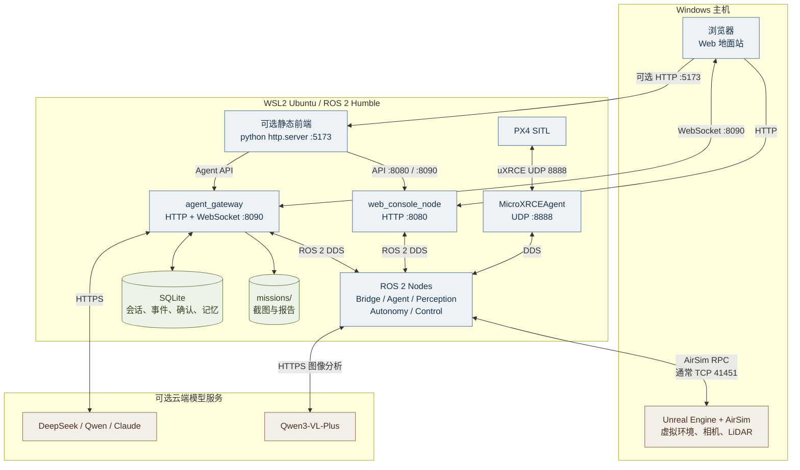

### 2.1 两条容易混淆的通信链

```text
PX4 数据和控制：
PX4 Client -> UDP 8888 -> MicroXRCEAgent -> DDS -> ROS 2

AirSim 传感器：
AirSim Server -> RPC API -> airsim_bridge_node -> ROS 2 Topic
```

MicroXRCE-DDS Agent 不负责传输 AirSim 图像。AirSim Bridge 也不代替 PX4 飞控。

---

## 3. 软件分层架构图

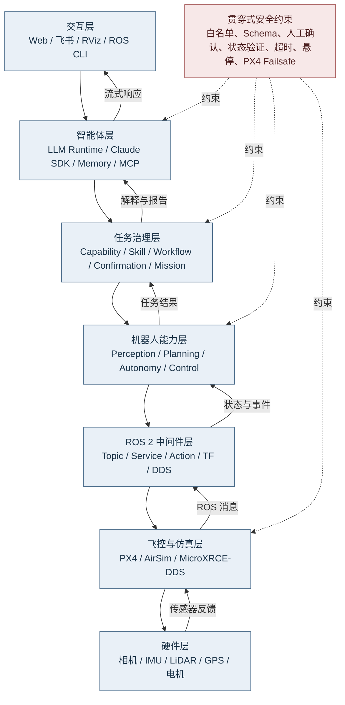

核心原则：越接近底层，实时性越高、行为越确定；越接近上层，语义能力越强，但不能绕过底层安全约束。

---

## 4. ROS 2 包模块图

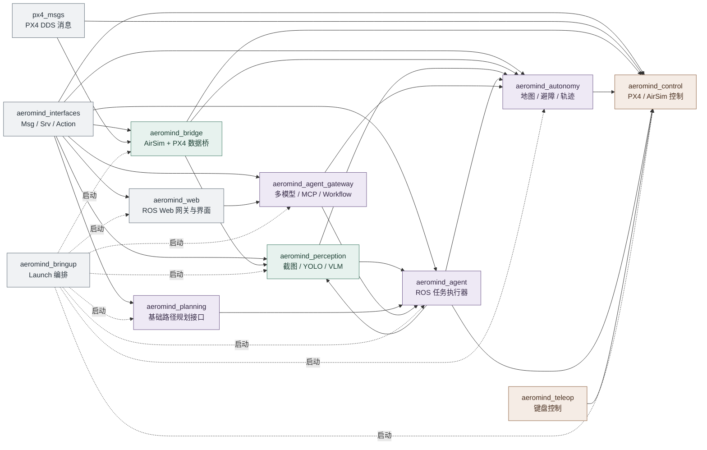

### 4.1 各包职责

| ROS 2 包 | 主要职责 | 典型输入 | 典型输出 |
|---|---|---|---|
| `aeromind_interfaces` | 统一消息与服务契约 | 无 | `DroneState`、`Trajectory`、`FollowWaypoints` 等 |
| `aeromind_bridge` | AirSim/PX4 数据转换 | AirSim RPC、`/fmu/out/*` | RGB、Depth、PointCloud、Odometry、TF |
| `aeromind_perception` | 检测、截图和语义分析 | RGB、YOLO detection | Detection、ImageAnalysis、PNG |
| `aeromind_planning` | 路径规划服务入口 | 规划请求 | 基础 Path |
| `aeromind_autonomy` | 局部地图、避障和轨迹 | Depth、PointCloud、Odometry、Goal | Trajectory、AutonomyStatus |
| `aeromind_control` | 飞行命令和轨迹跟踪 | Service、Trajectory、Odometry | PX4 setpoint、DroneState |
| `aeromind_agent` | 将结构化动作映射到 ROS 能力 | ExecuteTask、ExecuteAction | Mission 状态、ROS 调用 |
| `aeromind_agent_gateway` | 模型、会话、MCP、确认和 Workflow | Web/飞书消息 | 流式事件、确认、ROS Action |
| `aeromind_web` | ROS 数据转 HTTP/WebSocket | ROS Topic | 浏览器状态、图像和点云 |
| `aeromind_bringup` | 统一启动和参数传递 | Launch 参数 | 完整节点集合 |
| `aeromind_teleop` | 键盘人工控制 | 键盘 | `/control/cmd_vel` |

---

## 5. ROS 2 通信接口总图

图中实线表示 Topic 数据流，虚线表示 Service 或 Action 请求。

```mermaid
flowchart LR
    BRIDGE[airsim_bridge_node]
    YOLO[yolo_detection_node]
    PER[perception_node]
    AUTO[autonomy_node]
    CTRL[control_node]
    AGENT[agent_node]
    GATE[agent_gateway]
    WEB[web_console_node]

    RGB[/sensor/camera/rgb/front_center]
    DEPTH[/sensor/camera/depth/front_center]
    INFO[/sensor/camera/depth/camera_info]
    CLOUD[/sensor/lidar/points]
    ODOM[/sensor/odometry]
    DET[/perception/detections]
    ANALYSIS[/perception/image_analysis]
    ASTATUS[/autonomy/status]
    TRAJ[/autonomy/trajectory]
    DSTATE[/control/drone_state]
    MISSION[/agent/mission_status]

    BRIDGE --> RGB
    BRIDGE --> DEPTH
    BRIDGE --> INFO
    BRIDGE --> CLOUD
    BRIDGE --> ODOM

    RGB --> YOLO
    RGB --> PER
    YOLO --> DET
    DET --> PER
    PER --> ANALYSIS

    DEPTH --> AUTO
    INFO --> AUTO
    CLOUD --> AUTO
    ODOM --> AUTO
    AUTO --> ASTATUS
    AUTO --> TRAJ

    TRAJ --> CTRL
    ODOM --> CTRL
    CTRL --> DSTATE

    DSTATE --> AGENT
    ODOM --> AGENT
    DET --> AGENT
    ANALYSIS --> AGENT
    ASTATUS --> AGENT
    AGENT --> MISSION

    DSTATE --> GATE
    ODOM --> GATE
    DET --> GATE
    ASTATUS --> GATE
    MISSION --> GATE

    RGB --> WEB
    DEPTH --> WEB
    CLOUD --> WEB
    DSTATE --> WEB
    ASTATUS --> WEB

    GATE -. /agent/execute_action .-> AGENT
    AGENT -. /control/takeoff<br/>/control/land<br/>/control/return_home .-> CTRL
    AGENT -. /perception/capture_image<br/>/perception/analyze_image .-> PER
    GATE -. /autonomy/follow_waypoints Action .-> AUTO
    AGENT -. /autonomy/goal .-> AUTO

    classDef node fill:#e7edf4,stroke:#526f8b,color:#1d3449
    classDef topic fill:#eef3e7,stroke:#6f824f,color:#31401f
    class BRIDGE,YOLO,PER,AUTO,CTRL,AGENT,GATE,WEB node
    class RGB,DEPTH,INFO,CLOUD,ODOM,DET,ANALYSIS,ASTATUS,TRAJ,DSTATE,MISSION topic
```

### 5.1 Topic、Service 和 Action 的选择原则

| 方式 | 适合的数据 | 项目示例 |
|---|---|---|
| Topic | 持续、实时、发布者不等待结果 | 图像、点云、状态、里程计、轨迹心跳 |
| Service | 一次请求、较快返回 | 解锁、拍照、图像分析、起飞请求 |
| Action | 长时间任务、需要反馈和取消 | 连续多航点飞行 |
| TF | 坐标系之间的平移和旋转 | `odom -> base_link -> camera/lidar` |

---

## 6. 传感器数据获取与感知模块图

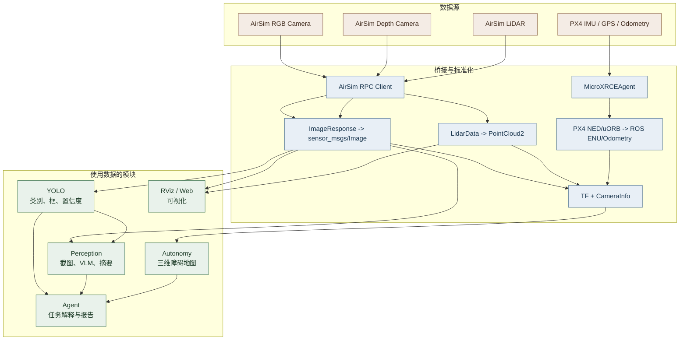

### 6.1 RGB 数据

```text
AirSim simGetImages(Scene)
  -> BGRA/BGR 原始字节
  -> sensor_msgs/Image
  -> /sensor/camera/rgb/front_center
```

### 6.2 深度与三维点

```text
AirSim simGetImages(DepthPerspective)
  -> float32 深度图 32FC1
  + CameraInfo 内参
  + TF 外参和无人机位姿
  -> 世界坐标三维障碍点
```

### 6.3 LiDAR 点云

```text
AirSim getLidarData()
  -> [x1,y1,z1,x2,y2,z2,...]
  -> sensor_msgs/PointCloud2
  -> /sensor/lidar/points
```

---

## 7. TF 坐标树

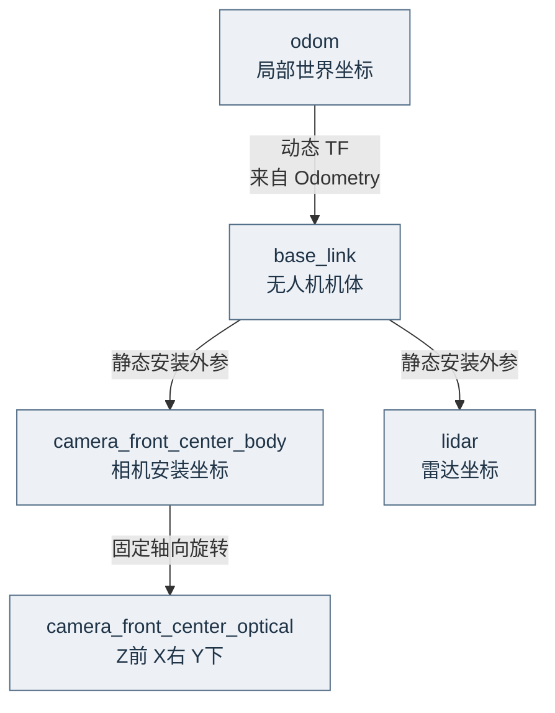

TF 解决的是“同一个三维点在不同坐标系中如何表达”。它不存储图像或点云，只存储坐标变换关系。

---

## 8. Agent、Skill 与 Workflow 模块图

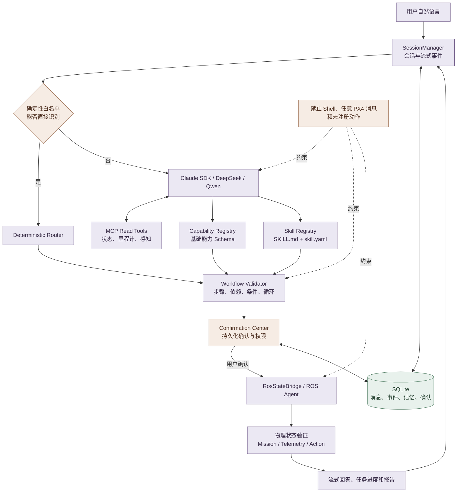

### 8.1 三层能力关系

```text
基础能力 Capability
  例如：takeoff、land、move、follow_waypoints、capture_image
                  ↓ 组合
固定技能 Skill
  例如：正方形、V 字、人员巡检、安全起飞拍照
                  ↓ 动态编排
Workflow
  例如：检查状态 -> 起飞 -> 巡检 -> 条件检测 -> 拍照 -> 返航
```

`SKILL.md` 用来告诉模型技能的语义和使用方法，`skill.yaml` 定义参数与可执行步骤，真正执行的仍是已经注册的 ROS 基础能力。

---

## 9. 自主避障与连续轨迹模块图

```mermaid
flowchart TB
    INPUT[输入<br/>Odometry + Depth + PointCloud + Goal]
    QUALITY{传感器新鲜且<br/>里程计质量合格}
    TF2[TF 转换到世界坐标]
    MAP[Rolling Voxel Map<br/>射线清障 + 衰减 + 裁剪]
    ESDF[ESDF 风格 Clearance Query]
    WAYPOINT{任务类型}
    SINGLE[单目标局部重规划]
    MULTI[连续多航点<br/>Minimum Snap]
    CHECK[未来时间窗碰撞检查]
    SAFE{轨迹安全}
    LOCAL[Kinodynamic Motion Primitives<br/>直飞 / 左右绕 / 爬升 / 下降]
    SPLICE[保留安全短航段<br/>重拼接剩余 Minimum Snap]
    ACTION[FollowWaypoints Action<br/>反馈 / 取消 / 结果]
    TRAJ[/autonomy/trajectory]
    HOLD[安全悬停<br/>SENSOR_WAIT / BLOCKED]

    INPUT --> QUALITY
    QUALITY -->|否| HOLD
    QUALITY -->|是| TF2 --> MAP --> ESDF
    INPUT --> WAYPOINT
    WAYPOINT -->|单点| SINGLE
    WAYPOINT -->|多航点| MULTI
    ESDF --> SINGLE
    ESDF --> CHECK
    MULTI --> CHECK --> SAFE
    SAFE -->|是| ACTION
    SAFE -->|否| LOCAL
    ESDF --> LOCAL
    LOCAL -->|有安全候选| SPLICE --> CHECK
    LOCAL -->|无安全候选| HOLD
    SINGLE -->|安全轨迹| TRAJ
    ACTION --> TRAJ
    HOLD --> TRAJ

    classDef data fill:#e8f0f7,stroke:#527491,color:#1d374d
    classDef decision fill:#f5ece3,stroke:#976847,color:#4a2d1c
    classDef plan fill:#e9f1eb,stroke:#527d60,color:#233f2c
    class INPUT,TF2,MAP,ESDF,TRAJ data
    class QUALITY,WAYPOINT,SAFE decision
    class SINGLE,MULTI,CHECK,LOCAL,SPLICE,ACTION,HOLD plan
```

### 9.1 多航点局部改道过程

```text
原始连续轨迹
  -> 检查未来 3 秒
  -> 发现安全距离不足
  -> 选择安全运动基元
  -> 生成短距离绕行段
  -> 保留短段末端速度和加速度
  -> 对未完成航点重新生成 Minimum Snap
  -> reset_time 帧立即切换控制器时间轴
  -> 继续同一个 ROS 2 Action
```

---

## 10. Control 与 PX4 控制闭环图

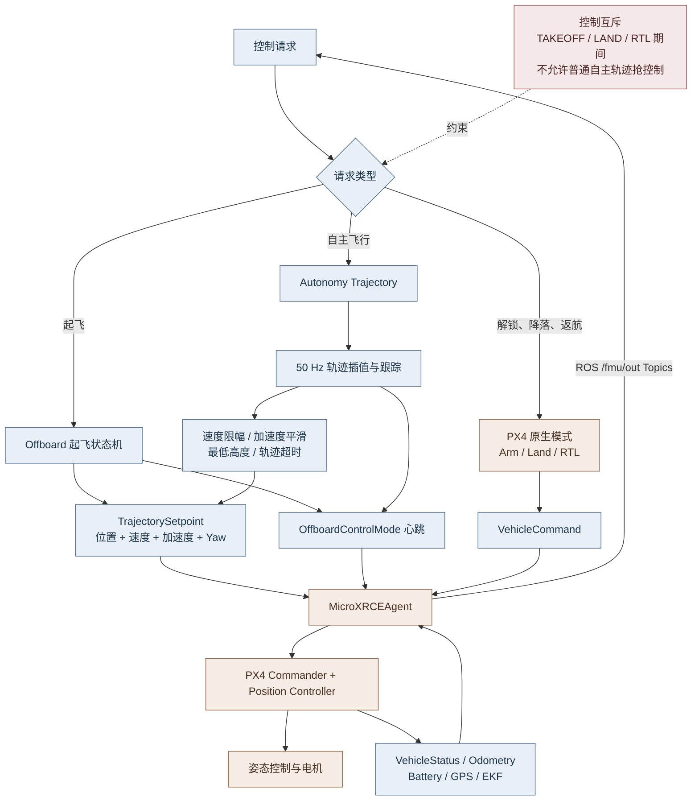

PX4 负责真正的高频姿态和电机闭环。ROS 2 Control 层发送目标状态，不直接计算每个电机的转速。

---

## 11. Web 数据链路图

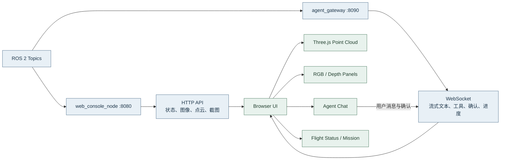

浏览器不能直接消费普通 ROS 2 消息，因此必须由 Web 节点转换：

- ROS `Image` 转为浏览器可显示的 JPEG/PNG。
- ROS `PointCloud2` 抽样并转为 JSON/二进制点集合。
- ROS 状态消息转为 HTTP/WebSocket JSON。
- Agent token 增量转为聊天流式事件。

---

## 12. 复杂任务执行时序图

示例任务：

```text
检查状态，如果安全就起飞到 10 米，飞一个正方形，
发现人就拍照，最后返航并生成报告。
```

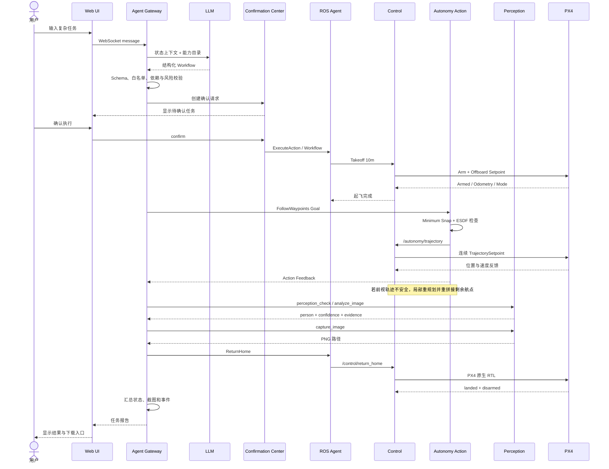

---

## 13. 关键模块内部结构

### 13.1 Agent Gateway

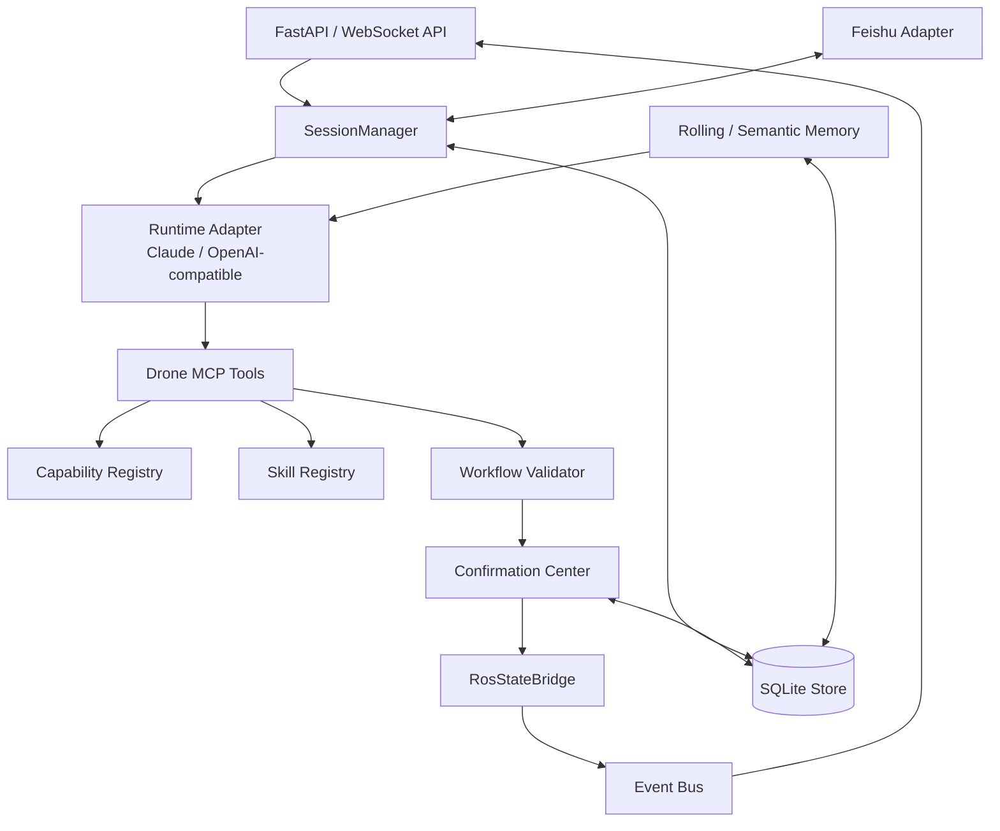

### 13.2 Autonomy

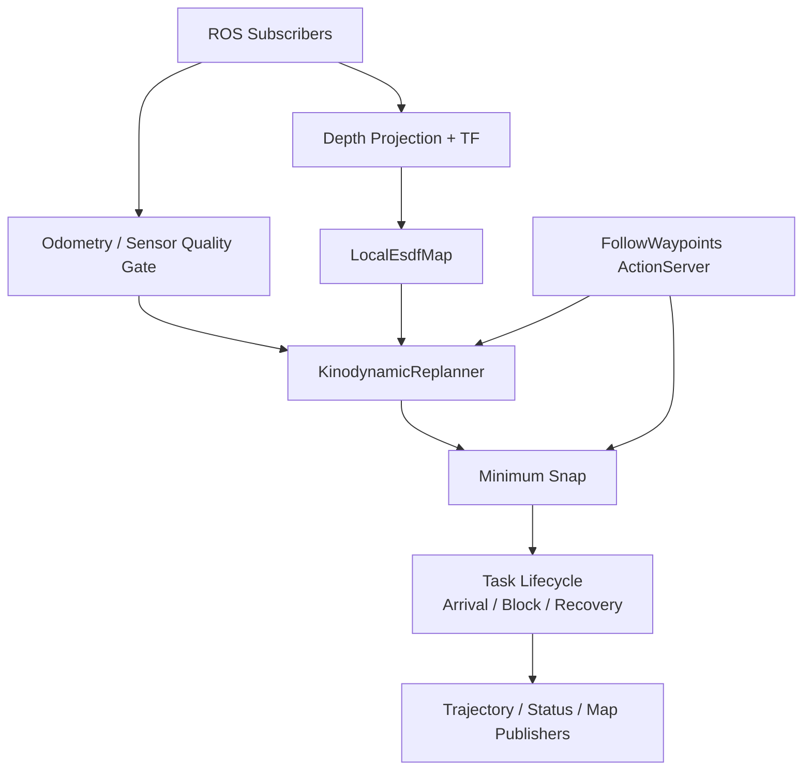

### 13.3 Control

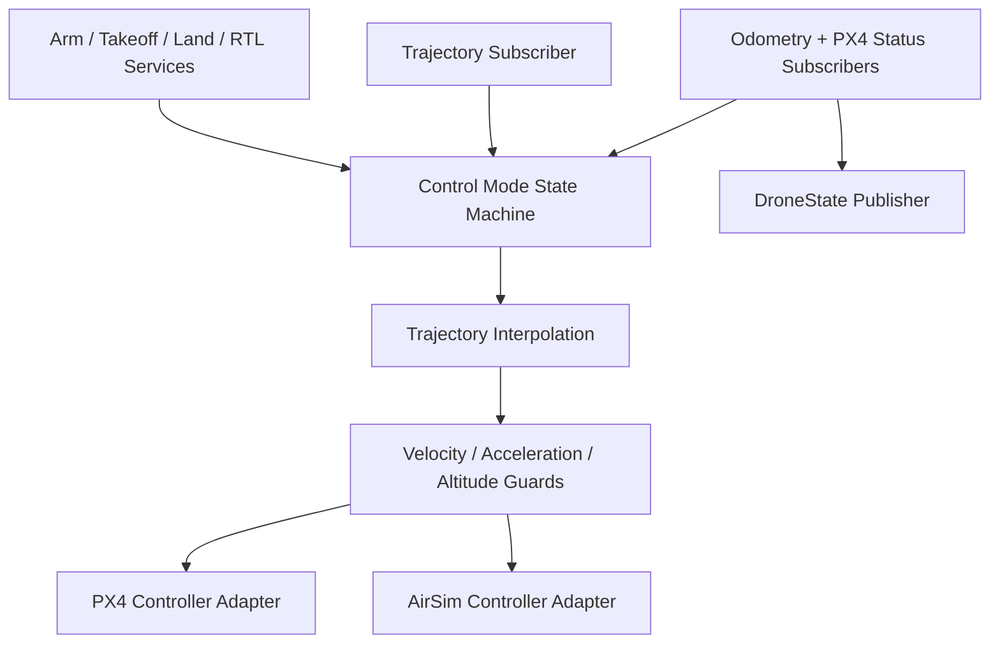

---

## 14. 安全边界图

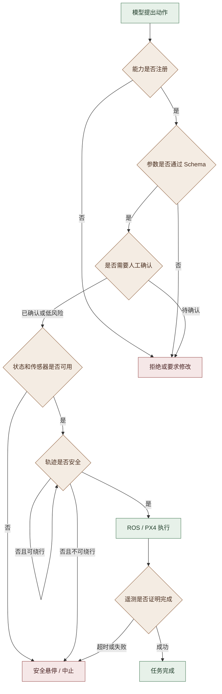

大模型可以提出任务和策略，但不能绕过图中的任何安全门。

---

## 15. 如何使用这些图学习项目

推荐按以下顺序理解：

1. 先看第 1 节，理解系统为什么分层。
2. 看第 2 节，弄清 Windows、WSL、PX4 和云端模型运行在哪里。
3. 看第 5 节，学习 Topic、Service 和 Action 如何连接节点。
4. 看第 6、7 节，理解传感器数据和 TF。
5. 看第 9、10 节，理解避障、轨迹和飞控的分工。
6. 看第 8、12 节，理解大模型如何生成任务但不直接控制电机。
7. 最后使用 ROS 命令逐条验证图中的连接。

常用验证命令：

```bash
ros2 node list
ros2 topic list
ros2 service list
ros2 action list
ros2 topic info /sensor/camera/rgb/front_center -v
ros2 topic info /autonomy/trajectory -v
ros2 action info /autonomy/follow_waypoints
ros2 run tf2_tools view_frames
```

读图时始终追问四个问题：

```text
1. 数据由哪个真实设备或程序产生？
2. 哪个节点把它转换成 ROS 消息？
3. 通过 Topic、Service 还是 Action 传输？
4. 哪个模块最终使用它做出什么行为？
```

只要能沿着图回答这四个问题，就已经掌握了该模块的基本架构。
